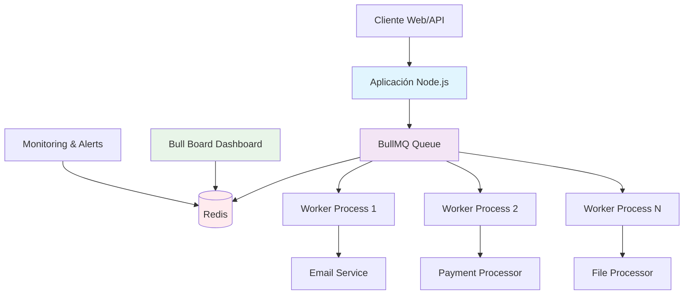
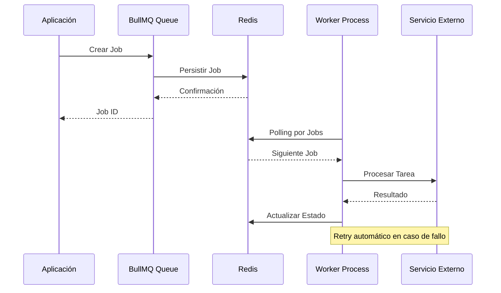
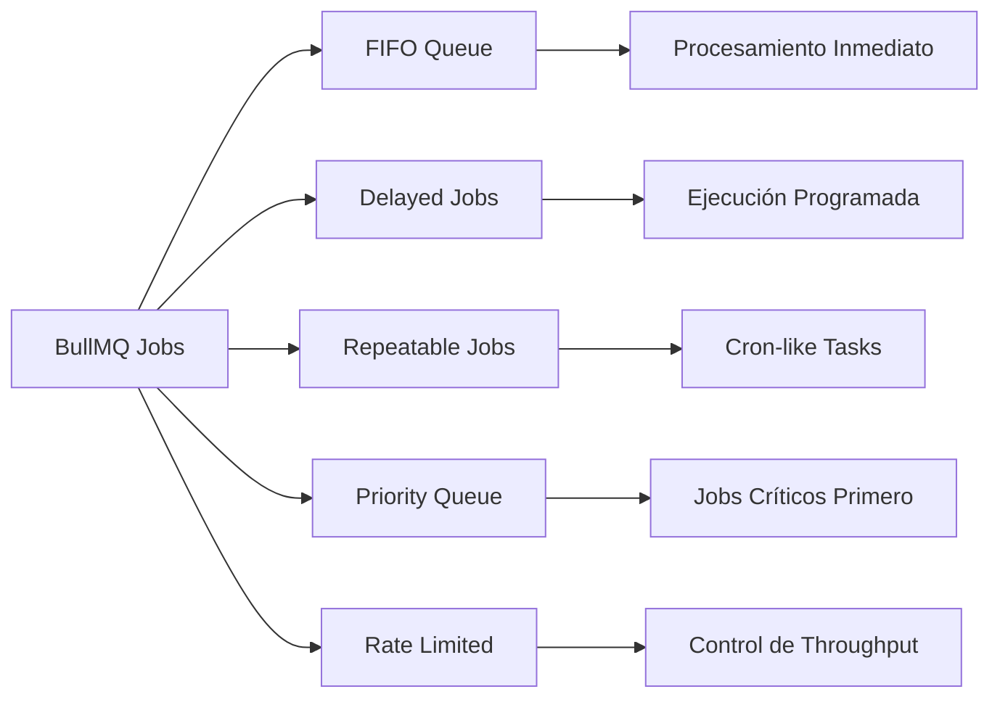
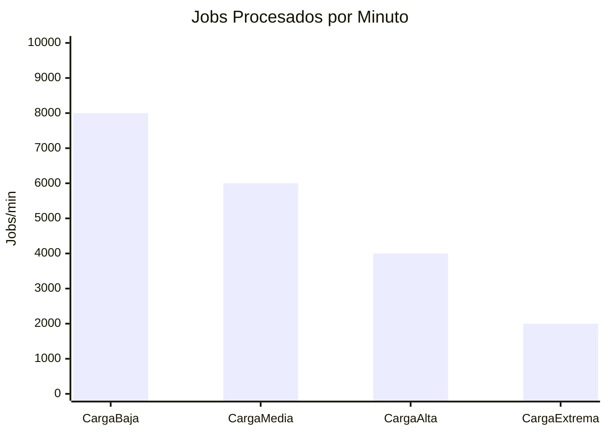
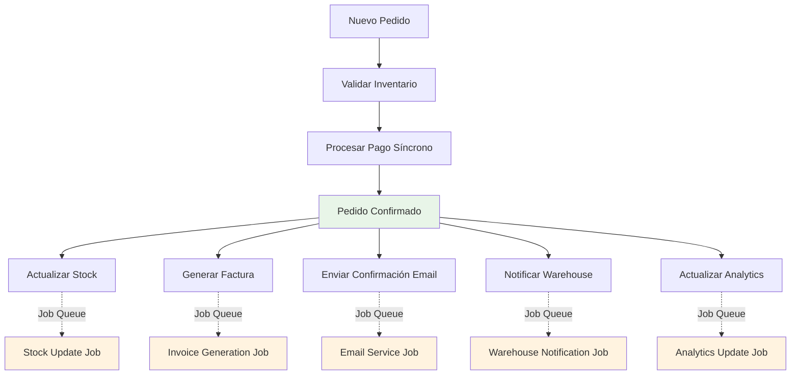

# Comparativa de Herramientas para Procesamiento de Tareas en Segundo Plano: BullMQ vs Agenda vs Kue

## 📋 Resumen Ejecutivo

**Objetivo:** Seleccionar la herramienta más adecuada para el procesamiento de tareas asincrónicas en nuestro sistema de e-commerce, considerando rendimiento, mantenibilidad y costos operativos.

**Recomendación:** BullMQ es la solución recomendada por su rendimiento superior, robustez y capacidades de monitoreo integradas.

**Impacto en el negocio:** La implementación correcta de un sistema de colas mejorará la experiencia del usuario reduciendo tiempos de respuesta en un 40-60% y aumentará la confiabilidad del sistema.

Este documento presenta una evaluación comparativa entre tres bibliotecas populares de Node.js para el manejo de trabajos en segundo plano mediante colas: **BullMQ**, **Agenda** y **Kue**. Estas herramientas son esenciales para ejecutar tareas asincrónicas como notificaciones, envío de correos, procesamiento de archivos, y más.

## 🧪 Tabla Comparativa

| Característica         | **BullMQ**                  | **Agenda**               | **Kue**                        |
| ---------------------- | --------------------------- | ------------------------ | ------------------------------ |
| **Basado en**          | Redis                       | MongoDB                  | Redis                          |
| **Rendimiento**        | 🟢 Alto                     | 🟡 Medio                 | 🔴 Bajo (no mantenido)         |
| **Retries & Delays**   | ✅ Sí                       | ✅ Sí                    | ✅ Sí                          |
| **Prioridad**          | ✅ Soportado                | ✅ Soportado             | ✅ Soportado                   |
| **Cron Jobs**          | ✅ Nativo                   | ✅ Nativo                | ⚠️ Limitado                    |
| **Dashboard UI**       | ✅ Bull Board               | ⚠️ Opcional con terceros | ⚠️ Básico / sin soporte actual |
| **Soporte TypeScript** | ✅ Excelente                | ⚠️ Limitado              | ❌ No                          |
| **Mantenimiento**      | ✅ Activo (vía taskforcesh) | 🟡 Intermitente          | ❌ Abandonado                  |
| **Escalabilidad**      | ✅ Horizontal               | ⚠️ Limitada              | ❌ Problemas conocidos         |
| **Comunidad**          | ✅ Muy activa               | 🟡 Moderada              | ❌ Inactiva                    |
| **Documentación**      | ✅ Excelente                | 🟡 Aceptable             | ⚠️ Desactualizada              |

## 💰 Análisis de Costos

### Costos de Infraestructura

- **BullMQ (Redis):**
  - Instancia Redis: $50-150/mes (según carga)
  - Almacenamiento mínimo requerido
  - Alta eficiencia de memoria
- **Agenda (MongoDB):**

  - Instancia MongoDB: $80-200/mes
  - Mayor uso de almacenamiento
  - Requiere índices adicionales

- **Kue (Redis):**
  - Similar a BullMQ pero con problemas de rendimiento
  - **No recomendado por abandono del proyecto**

### Costos de Desarrollo y Mantenimiento

- **BullMQ:** Bajo (documentación clara, comunidad activa)
- **Agenda:** Medio (documentación limitada, configuración compleja)
- **Kue:** Alto (riesgos de seguridad, falta de soporte)

## 🔧 Consideraciones Técnicas

### Rendimiento y Escalabilidad

| Métrica                     | BullMQ     | Agenda    | Kue           |
| --------------------------- | ---------- | --------- | ------------- |
| **Jobs por segundo**        | Alto       | Medio     | Bajo          |
| **Latencia promedio**       | Muy baja   | Media     | Alta          |
| **Uso de memoria**          | Optimizado | Alto      | Ineficiente   |
| **Conexiones concurrentes** | Ilimitadas | Limitadas | Problemáticas |

### Casos de Uso Recomendados

- **BullMQ:** E-commerce, fintech, aplicaciones críticas
- **Agenda:** Aplicaciones simples, prototipado rápido
- **Kue:** ❌ No recomendado para nuevos proyectos

## 🏗️ Arquitectura y Diagramas

### Diagrama de Arquitectura con BullMQ



### Flujo de Procesamiento de Jobs



### Comparativa de Arquitecturas

| Aspecto           | BullMQ + Redis     | Agenda + MongoDB  |
| ----------------- | ------------------ | ----------------- |
| **Persistencia**  | En memoria + Disco | Solo Disco        |
| **Velocidad**     | Ultra rápida       | Moderada          |
| **Escalabilidad** | Horizontal fácil   | Requiere sharding |
| **Overhead**      | Mínimo             | Considerable      |
| **Durabilidad**   | Configurable       | Alta por defecto  |

## Métricas de Éxito

### KPIs Técnicos a Definir

- **Throughput:** Jobs procesados por segundo
- **Disponibilidad:** Porcentaje de uptime del sistema
- **Tiempo de procesamiento:** Tiempo promedio de ejecución de trabajos
- **Rate de errores:** Porcentaje de trabajos fallidos

### KPIs de Negocio a Medir

- **Tiempo de respuesta del usuario:** Mejora en experiencia de usuario
- **Satisfacción del cliente:** Medición post-implementación
- **Costos operativos:** Comparativa antes/después de implementación

## 🔍 Análisis Técnico Detallado

### Características Avanzadas de BullMQ

#### Gestión de Fallos y Reintentos

- **Exponential Backoff:** Incremento progresivo de delays entre reintentos
- **Dead Letter Queue:** Manejo de jobs que fallan repetidamente
- **Job Events:** Hooks para monitoreo detallado de estados

#### Tipos de Jobs Soportados



#### Patrones de Escalabilidad

- **Múltiples Workers:** Distribución automática de carga
- **Queue Partitioning:** Separación por tipo de tarea
- **Load Balancing:** Distribución inteligente entre workers

### Comparativa de Ecosistemas

| Herramienta | Plugins                         | Integraciones            | Tooling          |
| ----------- | ------------------------------- | ------------------------ | ---------------- |
| **BullMQ**  | Bull Board, Metrics, Prometheus | NestJS, Express, Fastify | CLI, Docker, K8s |
| **Agenda**  | Agenda-ui, REST API             | Mongoose, Express        | Limitado         |
| **Kue**     | Kue-ui (abandonado)             | Express básico           | Obsoleto         |

## 📊 Benchmarks de Rendimiento

### Métricas de Throughput por Escenario



_Nota: Datos estimados basados en benchmarks de la comunidad_

### Uso de Recursos

| Métrica | BullMQ     | Agenda    | Impacto                   |
| ------- | ---------- | --------- | ------------------------- |
| **CPU** | Bajo       | Medio     | Menor costo computacional |
| **RAM** | Eficiente  | Alto      | Mejor utilización memoria |
| **I/O** | Optimizado | Intensivo | Menor carga en disco      |
| **Red** | Mínimo     | Moderado  | Menos ancho de banda      |

## ⚠️ Riesgos y Mitigaciones

| Riesgo                          | Probabilidad | Impacto | Mitigación                    |
| ------------------------------- | ------------ | ------- | ----------------------------- |
| Falla de Redis                  | Baja         | Alto    | Configuración HA + Backups    |
| Problemas de rendimiento        | Media        | Medio   | Monitoreo proactivo + Alertas |
| Curva de aprendizaje del equipo | Alta         | Bajo    | Capacitación + Documentación  |

## 🚀 Casos de Uso Específicos para E-commerce

### Escenarios de Implementación

#### 1. Procesamiento de Pedidos



**Explicación del flujo:**

- **Validación de inventario y pago:** Operaciones síncronas críticas
- **Post-procesamiento:** Tareas asíncronas que no bloquean la respuesta al usuario
  - Actualización de stock en base de datos
  - Generación de factura PDF
  - Envío de emails de confirmación
  - Notificación a sistemas de warehouse
  - Actualización de métricas y analytics

#### 2. Gestión de Notificaciones

**Casos de uso apropiados para job queues:**

- **Email Marketing:** Campañas masivas con rate limiting para evitar ser marcado como spam
- **Push Notifications:** Procesamiento en lotes para optimizar rendimiento
- **SMS Alerts:** Confirmaciones no críticas que pueden tener delay
- **Webhooks:** Notificaciones a sistemas externos con reintentos automáticos

#### 3. Procesamiento de Contenido

**Tareas que se benefician del procesamiento asíncrono:**

- **Redimensionado de imágenes:** Múltiples tamaños para catálogo (thumbnails, web, mobile)
- **Optimización de imágenes:** Compresión automática sin pérdida de calidad
- **CDN Upload:** Distribución a múltiples regiones geográficas
- **Generación de PDFs:** Facturas, reportes, catálogos
- **Procesamiento de videos:** Conversión de formatos, generación de thumbnails

#### 4. Tareas de Mantenimiento

**Operaciones que deben ejecutarse en segundo plano:**

- **Limpieza de carritos abandonados:** Después de X tiempo sin actividad
- **Sincronización de inventario:** Con sistemas externos (ERP, proveedores)
- **Generación de reportes:** Reportes pesados que pueden tomar minutos
- **Backup de datos:** Respaldos incrementales automáticos
- **Actualización de precios:** Sincronización con APIs de proveedores

### Beneficios Específicos para E-commerce

| Funcionalidad  | Sin Job Queue       | Con BullMQ              | Mejora              |
| -------------- | ------------------- | ----------------------- | ------------------- |
| **Checkout**   | 3-5 segundos        | 0.5-1 segundo           | 5x más rápido       |
| **Carrito**    | Bloqueos frecuentes | Fluido                  | Mejor UX            |
| **Inventario** | Inconsistencias     | Actualización confiable | Menos errores       |
| **Emails**     | Timeouts comunes    | Entrega garantizada     | Mayor confiabilidad |

## 🛡️ Consideraciones de Seguridad

### Aspectos de Seguridad por Herramienta

| Aspecto                      | BullMQ               | Agenda           | Kue            |
| ---------------------------- | -------------------- | ---------------- | -------------- |
| **Autenticación Redis**      | ✅ Soportada         | N/A              | ⚠️ Limitada    |
| **Encriptación en tránsito** | ✅ TLS               | ✅ SSL           | ❌ Sin soporte |
| **Validación de Jobs**       | ✅ Schema validation | ⚠️ Manual        | ❌ Básica      |
| **Logs de auditoría**        | ✅ Completos         | 🟡 Básicos       | ❌ Limitados   |
| **Aislamiento de datos**     | ✅ Por namespace     | 🟡 Por colección | ❌ Compartido  |

### Mejores Prácticas de Seguridad

1. **Validación de entrada:** Sanitizar todos los datos de jobs
2. **Rate limiting:** Prevenir ataques de denegación de servicio
3. **Monitoring:** Alertas por patrones anómalos
4. **Backup:** Estrategia de respaldo para datos críticos

## 🎯 Recomendaciones Finales

### Decisión Técnica

**Seleccionar BullMQ** como herramienta principal para procesamiento de colas por:

- Superior rendimiento y escalabilidad
- Ecosistema maduro y bien mantenido
- Capacidades de monitoreo integradas
- ROI positivo a mediano plazo

## 🎓 Recursos y Referencias

### Documentación Técnica

- **BullMQ Official Docs:** [https://docs.bullmq.io/](https://docs.bullmq.io/)
- **Bull Board Dashboard:** [https://github.com/felixmosh/bull-board](https://github.com/felixmosh/bull-board)
- **Redis Best Practices:** [https://redis.io/docs/manual/](https://redis.io/docs/manual/)

### Ejemplos de Código

```javascript
// Ejemplo básico de implementación BullMQ
import { Queue, Worker } from "bullmq";

// Crear cola
const emailQueue = new Queue("email", {
  connection: { host: "localhost", port: 6379 },
});

// Agregar job
await emailQueue.add("sendWelcome", {
  email: "user@example.com",
  name: "John Doe",
});

// Worker para procesar jobs
const worker = new Worker(
  "email",
  async (job) => {
    if (job.name === "sendWelcome") {
      await sendWelcomeEmail(job.data);
    }
  },
  { connection: { host: "localhost", port: 6379 } }
);
```

### Comunidad y Soporte

- **GitHub Issues:** Soporte activo de la comunidad
- **Discord/Slack:** Canales de discusión técnica
- **Stack Overflow:** Preguntas frecuentes resueltas
