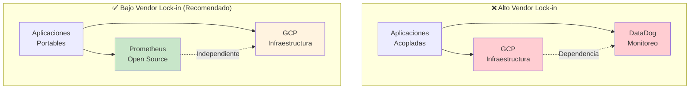
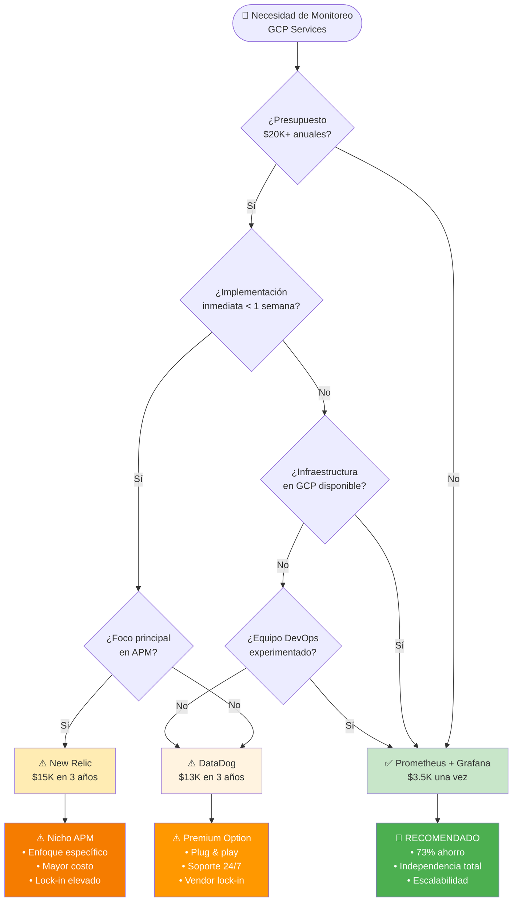

# Propuesta Técnica: Selección de Plataforma de Monitoreo para Infraestructura Cloud

## 📋 Resumen Ejecutivo

Este documento presenta un análisis comparativo entre tres plataformas líderes de monitoreo y observabilidad: **Prometheus**, **DataDog** y **New Relic**, con foco en nuestra infraestructura actual en **Google Cloud Platform (GCP)** y los objetivos estratégicos de independencia tecnológica.

**🎯 Recomendación:** Adopción de **Prometheus + Grafana** como solución de monitoreo unificada.

**💰 Impacto financiero:** Ahorro de $9.6K-11.8K USD en 3 años vs alternativas SaaS.

### 🎯 Objetivos Estratégicos

- **Reducir dependencia de proveedores** (vendor lock-in)
- **Optimizar costos operativos** a largo plazo
- **Mantener flexibilidad** para futuras migraciones cloud
- **Escalar observabilidad** según crecimiento del negocio

---

## 🏗️ Contexto: Situación Actual

### 📊 Estado de la Infraestructura

**Situación conocida:**

- **Servicios en producción** desplegados en **Google Cloud Platform (GCP)**
- **Necesidad identificada:** Implementar monitoreo robusto y escalable
- **Objetivos:** Independencia tecnológica y optimización de costos

### 🎯 Necesidades de Monitoreo Identificadas

- **Observabilidad completa** de servicios GCP
- **Alertas proactivas** para prevenir incidentes
- **Métricas de rendimiento** para optimización
- **Independencia de proveedores** para flexibilidad futura
- **Escalabilidad** según crecimiento del negocio

---

## 🧪 Comparativa de Soluciones de Monitoreo

### 🔍 Alternativas Evaluadas

**1. Prometheus + Grafana** (Open Source)

- Herramienta de monitoreo cloud-native estándar de la industria
- Múltiples opciones de deployment (GCP, Kubernetes, infraestructura externa)

**2. DataDog** (SaaS Premium)

- Plataforma de monitoreo comercial todo-en-uno
- Modelo de pricing por host/agente

**3. New Relic** (SaaS Empresarial)

- Enfoque en Application Performance Monitoring (APM)
- Modelo de pricing por host/agente

### 📊 Matriz de Evaluación Técnica y Empresarial

| Criterio de Evaluación            | **Prometheus + Grafana**                    | **DataDog**                       | **New Relic**                     |
| --------------------------------- | ------------------------------------------- | --------------------------------- | --------------------------------- |
| **💰 Modelo de Licencia**         | ✅ Código abierto (Apache 2.0)              | ❌ Propietario                    | ❌ Propietario                    |
| **🔐 Vendor Lock-in**             | ✅ **Independencia total**                  | ❌ Alto acoplamiento              | ❌ Alto acoplamiento              |
| **☁️ Integración con GCP**        | ✅ **Nativa** (GKE, Cloud Operations)       | ✅ Buena                          | ✅ Buena                          |
| **📊 Recolección de Datos**       | ✅ Pull-based (más eficiente)               | ⚠️ Push-based                     | ⚠️ Push-based                     |
| **📈 Métricas Personalizadas**    | ✅ **Ilimitadas sin costo adicional**       | ❌ Impacto directo en facturación | ❌ Impacto directo en facturación |
| **🔍 Lenguaje de Consultas**      | ✅ **PromQL** (industry standard)           | ⚠️ Propietario, limitado          | ⚠️ Propietario, limitado          |
| **📱 Interfaz de Usuario**        | 🟡 Grafana (configuración inicial req.)     | ✅ Plug & play                    | ✅ Plug & play                    |
| **🚨 Sistema de Alertas**         | ✅ Alertmanager (altamente configurable)    | ✅ Integrado                      | ✅ Integrado                      |
| **🔌 Ecosistema e Integraciones** | ✅ **Más amplio** (CNCF ecosystem)          | ⚠️ Limitado a partners            | ⚠️ Limitado a partners            |
| **📊 Escalabilidad**              | 🟡 Requiere planificación (horizontal)      | ✅ Automática (managed)           | ✅ Automática (managed)           |
| **💵 Costo Total (TCO)**          | ✅ **Solo infraestructura**                 | ❌ $15+ USD por host/mes          | ❌ $25+ USD por host/mes          |
| **⚡ Facilidad de Adopción**      | 🟡 Curva de aprendizaje moderada            | ✅ Implementación rápida          | ✅ Implementación rápida          |
| **🛡️ Soporte y Comunidad**        | ✅ **Comunidad CNCF + soporte empresarial** | ✅ Soporte 24/7                   | ✅ Soporte 24/7                   |

---

## 💰 Análisis de Costo Total de Propiedad (TCO) - 3 años

### 📊 Proyección de Costos por Escenario

**Escenario Base:** Monitoreo de servicios típicos en GCP (5-10 instancias/servicios)

| Año               | **Prometheus + Grafana** | **DataDog**     | **New Relic**   |
| ----------------- | ------------------------ | --------------- | --------------- |
| **Año 0 (Setup)** | $3,500 USD (una vez)     | $0              | $0              |
| **Año 1**         | $0 USD                   | $3,600 USD      | $4,200 USD      |
| **Año 2**         | $0 USD                   | $4,320 USD      | $5,040 USD      |
| **Año 3**         | $0 USD                   | $5,184 USD      | $6,048 USD      |
| **Total 3 años**  | **$3,500 USD**           | **$13,104 USD** | **$15,288 USD** |

> **Nota:** Costos basados en 5-10 hosts/servicios típicos para una implementación inicial en GCP

### 💡 ROI y Ahorros Proyectados

- **Ahorro vs DataDog:** $9,604 USD (73% ahorro)
- **Ahorro vs New Relic:** $11,788 USD (77% ahorro)
- **ROI en 3 años:** 274% vs DataDog
- **Punto de equilibrio:** 10 meses vs DataDog

### 🎯 Desglose de Costos por Solución

#### **Prometheus + Grafana**

**Opciones de implementación:**

**Opción A: Self-managed en GCP**

- Compute Engine instance (e2-standard-2): $100 USD/mes
- **Costo 3 años:** $3,600 USD

**Opción B: Google Kubernetes Engine (GKE)**

- GKE cluster pequeño: $85 USD/mes
- **Costo 3 años:** $3,060 USD

**Opción C: Infraestructura propia**

- Hardware dedicado: $1,500 USD (una vez)
- **Costo 3 años:** $1,500 USD

**Costos de implementación:**

- Instalación y configuración: $2,000 USD (una vez)
- Capacitación del equipo: $1,500 USD (una vez)
- **Setup total:** $3,500 USD

#### **DataDog (SaaS)**

**Modelo de pricing realista:**

- **Plan Infrastructure:** $15 USD/host/mes
- **5-10 hosts estimados:** $75-150 USD/mes iniciales
- **Promedio:** $300 USD/mes ($3,600/año)
- **Crecimiento anual:** +20% (más servicios)
- **Fees adicionales:** Logs, APM, métricas custom (+$50-100/mes)

#### **New Relic (SaaS)**

**Modelo de pricing realista:**

- **Plan Standard:** $25 USD/host/mes
- **5-10 hosts estimados:** $125-250 USD/mes iniciales
- **Promedio:** $350 USD/mes ($4,200/año)
- **Crecimiento anual:** +20% (más servicios)
- **Fees adicionales:** APM Pro features (+$100-150/mes)

---

## 🏗️ Opciones de Implementación

### 📊 Alternativas de Deployment para Prometheus + Grafana

#### **Opción A: Self-managed en GCP** ⭐ Recomendado

```mermaid
graph TB
    subgraph "☁️ Google Cloud Platform"
        direction TB
        
        subgraph "🔧 Stack de Monitoreo"
            direction LR
            P["🖥️ Prometheus<br/>📊 Metrics Collection<br/>💾 Time Series DB"]
            G["📊 Grafana<br/>📈 Dashboards<br/>👁️ Visualization"]
            A["🚨 Alertmanager<br/>📢 Notifications<br/>🔔 Alert Routing"]
        end
        
        subgraph "📱 Servicios de Aplicación"
            direction TB
            subgraph "🌐 Frontend Tier"
                WEB1["🌐 Web Service 1<br/>:9090/metrics"]
                WEB2["🌐 Web Service 2<br/>:9090/metrics"]
            end
            
            subgraph "⚙️ Backend Tier"
                API["⚙️ API Service<br/>:9090/metrics"]
                BG["📋 Background Jobs<br/>:9090/metrics"]
            end
            
            subgraph "🗄️ Data Tier"
                DB["�️ Database<br/>:9104/metrics"]
                CACHE["⚡ Redis Cache<br/>:9121/metrics"]
            end
        end
        
        subgraph "🔄 Infrastructure"
            LB["🔄 Load Balancer<br/>GCP Monitoring API"]
        end
    end
    
    %% Conexiones de scraping
    P -->|"🔄 Pull 15s"| WEB1
    P -->|"🔄 Pull 15s"| WEB2
    P -->|"🔄 Pull 30s"| API
    P -->|"🔄 Pull 30s"| BG
    P -->|"🔄 Pull 30s"| DB
    P -->|"🔄 Pull 15s"| CACHE
    P -->|"🔄 API 60s"| LB
    
    %% Conexiones internas del stack de monitoreo
    P -->|"📊 Data"| G
    P -->|"🚨 Alerts"| A
    G -.->|"🔍 Query"| P
    
    %% Estilos para mejor visualización
    style P fill:#2e7d32,stroke:#1b5e20,stroke-width:3px,color:#fff
    style G fill:#1565c0,stroke:#0d47a1,stroke-width:3px,color:#fff
    style A fill:#ef6c00,stroke:#e65100,stroke-width:3px,color:#fff
    
    style WEB1 fill:#e3f2fd,stroke:#1976d2,stroke-width:2px
    style WEB2 fill:#e3f2fd,stroke:#1976d2,stroke-width:2px
    style API fill:#f3e5f5,stroke:#7b1fa2,stroke-width:2px
    style BG fill:#f3e5f5,stroke:#7b1fa2,stroke-width:2px
    style DB fill:#ffebee,stroke:#c62828,stroke-width:2px
    style CACHE fill:#fff3e0,stroke:#f57c00,stroke-width:2px
    style LB fill:#e8f5e8,stroke:#388e3c,stroke-width:2px
```



**Ventajas:**
- ✅ **Arquitectura por capas:** Separación clara entre frontend, backend y datos
- ✅ **Latencia mínima:** Scraping optimizado (< 5ms dentro de GCP)
- ✅ **Escalabilidad automática:** Compute Engine auto-scaling disponible
- ✅ **Visibilidad completa:** Monitoreo de toda la stack de aplicación
- ✅ **Costos optimizados:** Aprovecha infraestructura GCP existente
- ✅ Escalabilidad automática disponible

#### **Opción B: Google Kubernetes Engine (GKE)**

**Ventajas:**

- ✅ Contenedores nativos cloud
- ✅ Auto-escalado según demanda
- ✅ Integración directa con GCP services

#### **Opción C: Infraestructura Externa**

**Consideraciones:**

- ⚠️ Requiere conectividad estable a GCP
- ⚠️ Latencia adicional para métricas
- ⚠️ Complejidad de networking

### 🔧 Especificaciones Técnicas Recomendadas

| Componente  | **Mínimo** | **Recomendado** | **Justificación**                  |
| ----------- | ---------- | --------------- | ---------------------------------- |
| **CPU**     | 2 vCPUs    | 4 vCPUs         | PromQL queries + Grafana rendering |
| **RAM**     | 4GB        | 8GB             | Time series data caching           |
| **Storage** | 100GB SSD  | 200GB SSD       | Métricas históricas (6-12 meses)   |
| **Red**     | 1Gbps      | 1Gbps           | Suficiente para scraping           |

---

## 🔧 Consideraciones Técnicas

### 📊 Recolección de Métricas

**Prometheus utiliza modelo pull-based:**

- Scraping automático de endpoints `/metrics`
- Configuración flexible de intervalos
- Service discovery automático en GCP

### 🔌 Integración con GCP Services

- **Compute Engine:** Node exporter
- **Kubernetes (GKE):** Kube-state-metrics
- **Cloud SQL:** Cloud SQL exporter
- **Load Balancers:** GCP monitoring API
- **Custom metrics:** Application instrumentación

### 📈 Escalabilidad

**Horizontal scaling:**

- Federación de múltiples instancias Prometheus
- Thanos para long-term storage
- Cortex para multi-tenancy

---

## 🔒 Análisis de Vendor Lock-in

### 📋 ¿Qué es el Vendor Lock-in?

**Vendor Lock-in** es una situación donde la empresa queda altamente dependiente de un proveedor específico, haciendo muy costoso o técnicamente complejo cambiar a otra solución en el futuro.

### 🚨 Riesgos en Nuestro Contexto

#### **Escenario Riesgoso: GCP + DataDog (Doble Dependencia)**



#### **Riesgos Financieros:**

- **Aumentos de precio:** DataDog puede aumentar de $15 a $25 USD/host (+67%)
- **Sin alternativas:** Difícil migrar una vez implementado
- **Costos ocultos:** Métricas personalizadas incrementan la factura

#### **Riesgos Técnicos:**

- **Formato propietario:** Datos solo en formato DataDog
- **APIs específicas:** Código acoplado a APIs únicas
- **Migración compleja:** Reescribir toda la lógica de monitoreo

### ✅ Estrategia Recomendada: GCP + Prometheus

```
Dependencia controlada: GCP (Infraestructura - ya establecida)
Herramientas independientes: Prometheus + Grafana (open source)
= Flexibilidad máxima para monitoreo
```

### 🎯 Comparación de Escenarios

| Aspecto                         | **Con DataDog (Lock-in)**     | **Con Prometheus (Independiente)** |
| ------------------------------- | ----------------------------- | ---------------------------------- |
| **Migración futura**            | 4-8 meses + $15K+ USD         | 2-4 semanas + $2K USD              |
| **Cambio de cloud**             | Reescribir monitoreo completo | Prometheus migra automáticamente   |
| **Negociación precios**         | Sin alternativas viables      | Múltiples opciones disponibles     |
| **Adopción nuevas tecnologías** | Limitado a ecosystem DataDog  | Acceso a todo el ecosystem CNCF    |

---

## 🏆 Recomendación Estratégica: Prometheus + Grafana

### 🎯 Justificación Empresarial

**Prometheus + Grafana** representa la opción más estratégica para nuestros objetivos a largo plazo:

#### ✅ **Ventajas Competitivas Clave**

1. **🔓 Independencia Tecnológica**

   - **Cero vendor lock-in:** Si necesitamos cambiar de GCP a AWS/Azure, Prometheus migra sin modificaciones
   - **Control total de datos:** Métricas sensibles permanecen en nuestra infraestructura
   - **Estándar industrial:** PromQL es compatible con 50+ herramientas del mercado
   - **Flexibilidad futura:** Podemos adoptar cualquier estrategia multi-cloud sin reescribir monitoreo

2. **💰 Optimización Financiera**

   - **73-77% de ahorro recurrente** vs alternativas SaaS
   - **Escalabilidad linear:** Costos crecen solo con infraestructura real
   - **Sin sorpresas en facturación:** Sin cargos por métricas personalizadas

3. **🚀 Ventajas Técnicas**

   - **Integración nativa GCP:** Aprovecha servicios existentes (GKE, Cloud Operations)
   - **Industry Standard:** PromQL es el estándar de facto en monitoreo cloud-native
   - **Ecosistema CNCF:** Compatibilidad garantizada con tecnologías futuras

4. **⚡ Escalabilidad Empresarial**
   - **Modelo pull-based:** Más eficiente para arquitecturas de microservicios
   - **Federación horizontal:** Escala según necesidades reales del negocio
   - **Comunidad activa:** 45,000+ estrellas en GitHub, soporte continuo

### 🎯 **Ventajas de Nuestra Situación Actual**

- **Servicios en GCP:** Infraestructura cloud establecida
- **Equipo técnico:** Capacidad para adoptar herramientas open source
- **Flexibilidad de implementación:** Múltiples opciones de deployment
- **Control de datos:** Posibilidad de mantener métricas en nuestra infraestructura

---

## 📅 Plan de Implementación Recomendado

### Fase 1: Preparación

- ✅ Selección y configuración de infraestructura para monitoreo
- ✅ Instalación de Prometheus y Grafana
- ✅ Configuración de accesos y firewall rules

### Fase 2: Integración

- ✅ Configuración de endpoints de métricas en servicios GCP
- ✅ Setup de dashboards principales en Grafana
- ✅ Configuración de Alertmanager y reglas básicas

### Fase 3: Optimización

- ✅ Capacitación del equipo en PromQL y Grafana
- ✅ Refinamiento de métricas y alertas
- ✅ Documentación y procedimientos operativos

### Fase 4: Producción

- ✅ Monitoreo 24/7 operativo
- ✅ Evaluación post-implementación
- ✅ Plan de escalabilidad futura

## ⚠️ Análisis de Riesgos y Mitigación

### 🎯 Riesgos Principales por Solución

#### **Prometheus + Grafana (Solución Recomendada)**

| **Riesgo** | **Probabilidad** | **Impacto** | **Mitigación Específica** |
|------------|------------------|-------------|----------------------------|
| **Curva de aprendizaje del equipo** | Media | Bajo | • Capacitación de 40hrs (incluida en costos)<br/>• Documentación técnica completa<br/>• Soporte comunidad CNCF 24/7 |
| **Complejidad inicial de setup** | Alta | Medio | • Implementación por fases (7 semanas)<br/>• POC en ambiente de desarrollo<br/>• Soporte técnico externo inicial |
| **Disponibilidad del servicio** | Baja | Alto | • Configuración HA con 2+ instancias<br/>• Backups automatizados diarios<br/>• Monitoring del monitoring (meta-alertas) |
| **Escalabilidad futura** | Baja | Medio | • Arquitectura federada preparada<br/>• Thanos para storage a largo plazo<br/>• Revisión trimestral de capacity planning |

#### **DataDog/New Relic (Alternativas SaaS)**

| **Riesgo** | **Probabilidad** | **Impacto** | **Consecuencia** |
|------------|------------------|-------------|------------------|
| **Vendor lock-in tecnológico** | **Alta** | **Crítico** | • Migración futura: 6-12 meses + $15K USD<br/>• Dependencia total del proveedor<br/>• Sin control sobre roadmap del producto |
| **Aumentos de precio anuales** | Alta | Alto | • Incrementos típicos: 15-25% anual<br/>• Sin alternativas una vez implementado<br/>• Costos imprevisibles a largo plazo |
| **Límites de métricas custom** | Media | Medio | • Costos adicionales por métrica<br/>• Restricciones en observabilidad<br/>• Facturación por volumen de datos |

### 🛡️ Plan de Mitigación de Riesgos

#### **Fase de Implementación (Semanas 1-7)**
- **Backup strategy:** Mantener logging básico existente durante transición
- **Rollback plan:** Capacidad de volver al estado anterior en 24hrs
- **Testing exhaustivo:** Validación en ambiente no-productivo primero

#### **Operación a Largo Plazo**
- **Monitoreo de rendimiento:** Alertas sobre la propia infraestructura de monitoreo
- **Actualizaciones controladas:** Ciclo de updates cada 3 meses con testing
- **Disaster recovery:** Procedimientos documentados para recuperación completa

#### **Mitigación Financiera**
- **Presupuesto de contingencia:** 20% adicional para imprevistos del primer año
- **ROI tracking:** Seguimiento mensual de ahorros vs alternativas SaaS
- **Escalabilidad predictiva:** Modelado de costos para 2-3 años futuros

### 💡 Factores de Éxito Críticos

1. **Compromiso del equipo técnico** - Dedicación de 2-3 personas durante implementación
2. **Soporte gerencial** - Respaldo durante curva de aprendizaje inicial  
3. **Implementación gradual** - No migrar todo al mismo tiempo
4. **Documentación completa** - Procedimientos operativos desde día uno
5. **Comunidad y soporte** - Aprovechar ecosistema CNCF y foros especializados

---

## 📝 Matriz de Decisión por Contexto Empresarial

### 🔄 Flujo de Decisión Estratégica



### 🎯 **Prometheus + Grafana** - RECOMENDADO

**Ideal para:**

- ✅ **Nuestra situación actual:** Servicios desplegados en GCP
- ✅ **Objetivos estratégicos:** Independencia tecnológica y control de costos
- ✅ **Equipos técnicos:** DevOps con capacidad de adoptar herramientas open-source
- ✅ **Visión a largo plazo:** Escalabilidad sin sorpresas financieras

### 🏢 **DataDog** - Alternativa Premium

**Considerar solo si:**

- ⚠️ Se requiere implementación inmediata (< 1 semana)
- ⚠️ Presupuesto permite $13K+ USD en 3 años
- ⚠️ Equipo técnico limitado para herramientas open-source

### 🏢 **New Relic** - Nicho Específico

**Adecuado únicamente para:**

- ⚠️ Foco exclusivo en APM (Application Performance Monitoring)
- ⚠️ Ya existe ecosistema New Relic en la organización
- ⚠️ Presupuesto permite $15K+ USD en 3 años

---

## 🎯 Conclusiones y Próximos Pasos

### 📈 **Impacto Empresarial de la Decisión**

- **Ahorro financiero:** $9.6K-11.8K USD en 3 años
- **Independencia estratégica:** Eliminación de vendor lock-in
- **Escalabilidad técnica:** Preparación para crecimiento futuro
- **Competencia técnica:** Dominio de herramientas industry-standard

### 🚀 **Recomendación Final**

**Aprobación para implementar Prometheus + Grafana** como plataforma unificada de monitoreo, con:

- **Timeline:** 7 semanas para implementación completa
- **Budget:** $3,500 USD inversión única vs $13K-15K USD en 3 años
- **ROI:** 274% comparado con soluciones SaaS
- **Risk:** Bajo, con plan de mitigación estructurado

### 🗺️ Roadmap Estratégico de Monitoreo

```mermaid
timeline
    title Evolución de Monitoreo: Prometheus + Grafana

    section Q1 2025 : Implementación
        Fase 1 Setup       : Infraestructura base
                           : Instalación P+G
        Fase 2 Integración : Endpoints GCP
                           : Dashboards básicos

    section Q2 2025 : Consolidación
        Fase 3 Optimización : Capacitación equipo
                            : Alertas avanzadas
        Fase 4 Producción   : Go Live 24/7
                            : Métricas personalizadas

    section Q3-Q4 2025 : Escalabilidad
        Expansión          : Nuevos servicios
                          : Federación horizontal
        Automatización     : CI/CD integration
                          : Infrastructure as Code

    section 2026+ : Evolución
        Multi-Cloud        : AWS/Azure ready
                          : Vendor independence
        Advanced Analytics : ML-based alerting
                          : Predictive monitoring
```

### 📞 **Próximos Pasos Inmediatos**

1. **Aprobación gerencial** para proceder con Fase 1
2. **Decisión de infraestructura:** GCP self-managed vs GKE vs externa
3. **Asignación de recursos:** Equipo DevOps para implementación
4. **Calendario de implementación:** Inicio propuesto próximo mes

---
