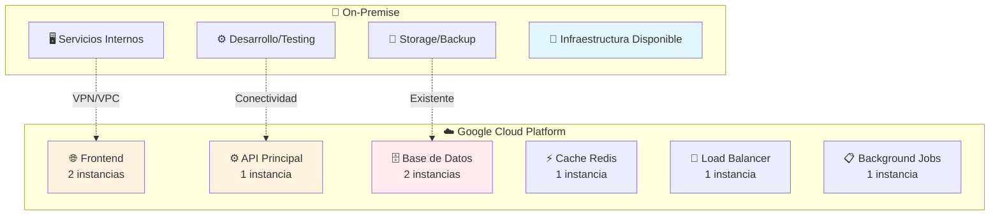
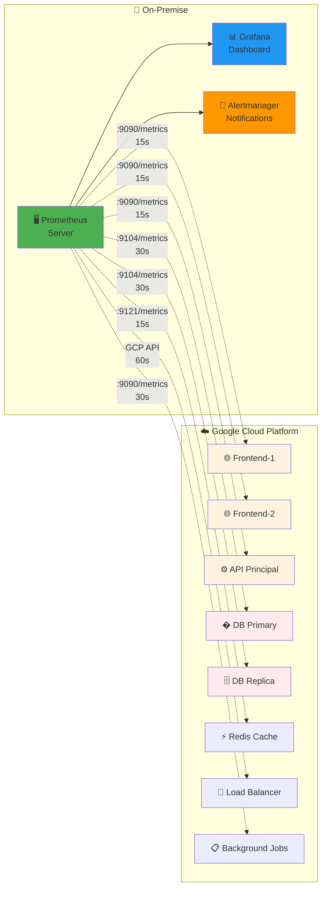
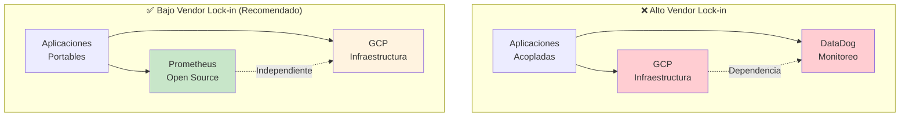
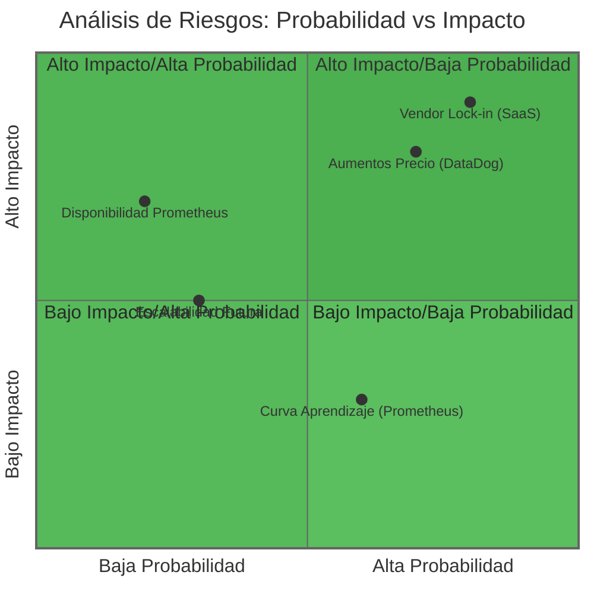
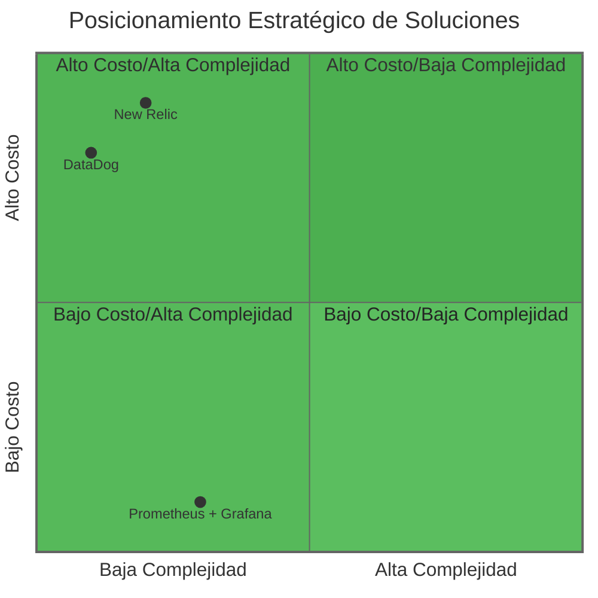
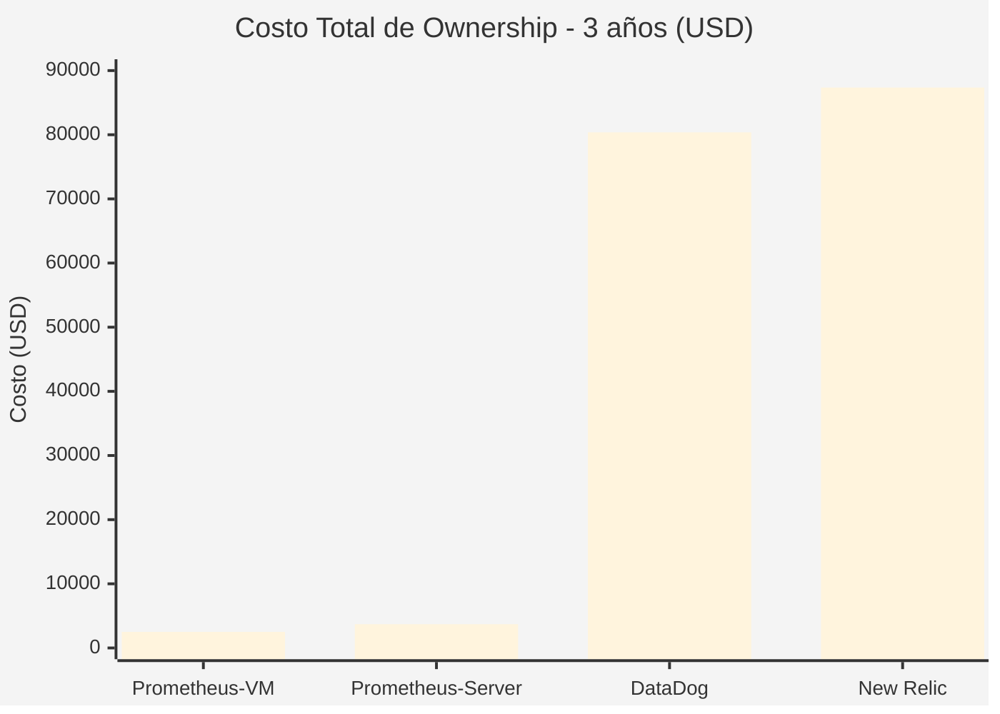
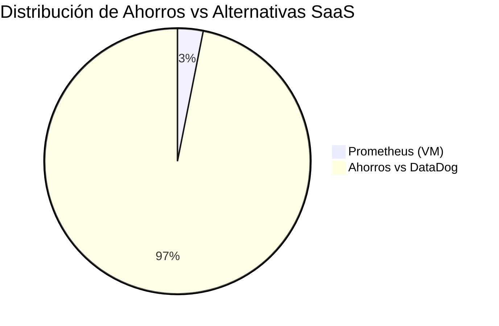

# Propuesta Técnica: Selección de Plataforma de Monitoreo para Infraestructura Cloud

## 📋 Resumen Ejecutivo

Este documento presenta un análisis comparativo entre tres plataformas líderes de monitoreo y observabilidad: **Prometheus**, **DataDog** y **New Relic**, con foco en nuestra infraestructura actual en **Google Cloud Platform (GCP)** y los objetivos estratégicos de independencia tecnológica.

**🎯 Recomendación:** Adopción de **Prometheus + Grafana** como solución de monitoreo unificada.

**💰 Impacto financiero:** Ahorro de $77K-85K USD en 3 años vs alternativas SaaS.

### 🎯 Objetivos Estratégicos

- **Reducir dependencia de proveedores** (vendor lock-in)
- **Optimizar costos operativos** a largo plazo
- **Mantener flexibilidad** para futuras migraciones cloud
- **Escalar observabilidad** según crecimiento del negocio

---

## 🏗️ Contexto: Nuestra Arquitectura Actual

### 📊 Infraestructura Híbrida Existente

Actualmente operamos una arquitectura híbrida que nos brinda ventajas únicas:



**Servicios en GCP que requieren monitoreo:** 8 servicios críticos

### 🎯 Necesidades de Monitoreo Identificadas

- **Monitoreo remoto:** Desde on-premise hacia servicios GCP
- **Conectividad existente:** VPN/VPC ya establecida
- **Criticidad moderada:** Monitoreo no es crítico para disponibilidad (tenemos respaldo on-premise)
- **Escalabilidad futura:** Preparación para crecimiento gradual

---

## 🧪 Comparativa de Soluciones de Monitoreo

### 🔍 Alternativas Evaluadas

**1. Prometheus + Grafana** (Open Source)

- Herramienta de monitoreo cloud-native estándar de la industria
- Instalación on-premise con monitoreo remoto a GCP

**2. DataDog** (SaaS Premium)

- Plataforma de monitoreo comercial todo-en-uno
- Modelo de pricing por host/agente

**3. New Relic** (SaaS Empresarial)

- Enfoque en Application Performance Monitoring (APM)
- Modelo de pricing por host/agente

### 📊 Matriz de Evaluación Técnica y Empresarial

| Criterio de Evaluación            | **Prometheus + Grafana**                    | **DataDog**                       | **New Relic**                     |
| --------------------------------- | ------------------------------------------- | --------------------------------- | --------------------------------- |
| **💰 Modelo de Licencia**         | ✅ Código abierto (Apache 2.0)              | ❌ Propietario                    | ❌ Propietario                    |
| **🔐 Vendor Lock-in**             | ✅ **Independencia total**                  | ❌ Alto acoplamiento              | ❌ Alto acoplamiento              |
| **☁️ Integración con GCP**        | ✅ **Nativa** (GKE, Cloud Operations)       | ✅ Buena                          | ✅ Buena                          |
| **📊 Recolección de Datos**       | ✅ Pull-based (más eficiente)               | ⚠️ Push-based                     | ⚠️ Push-based                     |
| **📈 Métricas Personalizadas**    | ✅ **Ilimitadas sin costo adicional**       | ❌ Impacto directo en facturación | ❌ Impacto directo en facturación |
| **🔍 Lenguaje de Consultas**      | ✅ **PromQL** (industry standard)           | ⚠️ Propietario, limitado          | ⚠️ Propietario, limitado          |
| **📱 Interfaz de Usuario**        | 🟡 Grafana (configuración inicial req.)     | ✅ Plug & play                    | ✅ Plug & play                    |
| **🚨 Sistema de Alertas**         | ✅ Alertmanager (altamente configurable)    | ✅ Integrado                      | ✅ Integrado                      |
| **🔌 Ecosistema e Integraciones** | ✅ **Más amplio** (CNCF ecosystem)          | ⚠️ Limitado a partners            | ⚠️ Limitado a partners            |
| **📊 Escalabilidad**              | 🟡 Requiere planificación (horizontal)      | ✅ Automática (managed)           | ✅ Automática (managed)           |
| **💵 Costo Total (TCO)**          | ✅ **Solo infraestructura**                 | ❌ $23+ USD por host/mes          | ❌ $25+ USD por host/mes          |
| **⚡ Facilidad de Adopción**      | 🟡 Curva de aprendizaje moderada            | ✅ Implementación rápida          | ✅ Implementación rápida          |
| **🛡️ Soporte y Comunidad**        | ✅ **Comunidad CNCF + soporte empresarial** | ✅ Soporte 24/7                   | ✅ Soporte 24/7                   |

---

## 💰 Análisis de Costo Total de Propiedad (TCO) - 3 años

### 📊 Proyección de Costos por Escenario

**Escenario Base:** Monitoreo de 8 servicios GCP desde infraestructura on-premise existente

> **Arquitectura híbrida:** Prometheus/Grafana instalado en servidores on-premise monitoreando servicios desplegados en GCP vía endpoints remotos

| Año               | **Prometheus (VM existente)** | **Prometheus (servidor nuevo)**  | **DataDog**     | **New Relic**   |
| ----------------- | ----------------------------- | -------------------------------- | --------------- | --------------- |
| **Año 0 (Setup)** | $2,500 USD (implementación)   | $3,700 USD (implementación + HW) | $0              | $0              |
| **Año 1**         | $0 USD                        | $0 USD                           | $22,080 USD     | $24,000 USD     |
| **Año 2**         | $0 USD                        | $0 USD                           | $26,496 USD     | $28,800 USD     |
| **Año 3**         | $0 USD                        | $0 USD                           | $31,795 USD     | $34,560 USD     |
| **Total 3 años**  | **$2,500 USD**                | **$3,700 USD**                   | **$80,371 USD** | **$87,360 USD** |

### 💡 ROI y Ahorros Proyectados

**Escenario 1: Usando VM en hardware existente**

- **Ahorro vs DataDog:** $77,871 USD (97% ahorro)
- **Ahorro vs New Relic:** $84,860 USD (97% ahorro)
- **ROI en 3 años:** 3,115% vs DataDog

**Escenario 2: Con servidor dedicado nuevo**

- **Ahorro vs DataDog:** $76,671 USD (95% ahorro)
- **Ahorro vs New Relic:** $83,660 USD (96% ahorro)
- **ROI en 3 años:** 2,073% vs DataDog

**Punto de equilibrio:** El servidor se paga solo en 2 meses vs DataDog

### 🎯 Desglose de Costos SOLO para Monitoreo

#### **Prometheus + Grafana (On-Premise)**

**Costos de licencias:** $0 USD (open source)

**Inversión inicial en hardware (si es necesario):**

- **Servidor dedicado:** $1,200 USD (opción Dell T140)
- **O usar VM en hardware existente:** $0 USD

**Costos de implementación única:**

- Instalación y configuración: $1,500 USD (una vez)
- Capacitación del equipo: $1,000 USD (una vez)
- **Total implementación:** $2,500 USD + hardware

**Costos recurrentes:** $0 USD/año (mantenimiento incluido en OpEx existente)

**Escenarios de inversión total:**

- **Con servidor nuevo:** $3,700 USD (una vez)
- **Con VM existente:** $2,500 USD (una vez)

#### **DataDog (SaaS)**

**Costo por agente:** $23 USD/mes × 8 servicios = $184 USD/mes

- **Año 1:** $2,208 USD + fees = $2,500 USD aprox
- **Crecimiento anual:** +20% (más servicios)

#### **New Relic (SaaS)**

**Costo por agente:** $25 USD/mes × 8 servicios = $200 USD/mes

- **Año 1:** $2,400 USD + fees = $2,700 USD aprox
- **Crecimiento anual:** +20% (más servicios)

---

## 🖥️ Recomendaciones de Hardware On-Premise

### 📊 Especificaciones Recomendadas

| Componente  | **Mínimo**       | **Recomendado**  | **Justificación**                  |
| ----------- | ---------------- | ---------------- | ---------------------------------- |
| **CPU**     | 4 cores @ 2.4GHz | 8 cores @ 3.0GHz | PromQL queries + Grafana rendering |
| **RAM**     | 8GB              | 16GB             | Time series data caching + OS      |
| **Storage** | 500GB SSD        | 1TB NVMe SSD     | Métricas históricas (1-2 años)     |
| **Red**     | 1Gbps            | 1Gbps            | Suficiente para scraping remoto    |
| **OS**      | Ubuntu 20.04+    | Ubuntu 22.04 LTS | Estabilidad y soporte largo        |

### 💻 Opciones de Hardware Recomendadas

**Opción 1: Dell PowerEdge T140** - $1,200 USD

- **CPU:** Intel Xeon E-2224 (4 cores @ 3.4GHz)
- **RAM:** 16GB DDR4 ECC
- **Storage:** 1TB SSD SATA
- **Ventaja:** Confiabilidad empresarial, soporte Dell

**Opción 2: HP ProLiant ML110 Gen10** - $1,400 USD

- **CPU:** Intel Xeon Bronze 3204 (6 cores @ 1.9GHz)
- **RAM:** 16GB DDR4 ECC
- **Storage:** 1TB NVMe SSD
- **Ventaja:** Mejor performance storage, expandibilidad

**Opción 3: Supermicro SuperServer 5019S-L (Budget)** - $900 USD

- **CPU:** Intel Xeon E3-1230v6 (4 cores @ 3.5GHz)
- **RAM:** 16GB DDR4 ECC
- **Storage:** 500GB NVMe SSD
- **Ventaja:** Costo optimizado, performance adecuado

**Opción 4: VM en servidor existente** - $0 USD

- **vCPU:** 4 cores
- **vRAM:** 8-12GB
- **vDisk:** 200GB (thin provisioned)
- **Ventaja:** Usa infraestructura actual

---

## 🏗️ Arquitectura de Monitoreo Híbrida

### 🔄 Diseño de la Solución

**Prometheus/Grafana ubicado ON-PREMISE monitoreando servicios GCP:**



**Costo de infraestructura:** $0 USD (usa servidores existentes)

### 🔧 Conectividad Requerida

- **VPN/VPC Peering:** Entre on-premise y GCP (ya existente)
- **Firewall rules:** Permitir puerto 9090 (Prometheus metrics)
- **Service discovery:** Kubernetes service discovery o endpoints estáticos

### 📊 Transferencia de Datos

| Servicio GCP        | Endpoint de Métricas | Frecuencia | Datos Transferidos |
| ------------------- | -------------------- | ---------- | ------------------ |
| **Frontend**        | `:9090/metrics`      | 15s        | ~1KB/scrape        |
| **API**             | `:9090/metrics`      | 15s        | ~2KB/scrape        |
| **Database**        | `:9104/metrics`      | 30s        | ~5KB/scrape        |
| **Cache**           | `:9121/metrics`      | 15s        | ~1KB/scrape        |
| **Load Balancer**   | GCP API              | 60s        | ~3KB/call          |
| **Background Jobs** | `:9090/metrics`      | 30s        | ~1KB/scrape        |

**Transferencia total:** ~50MB/mes (negligible)

---

## 🔒 Análisis de Vendor Lock-in

### 📋 ¿Qué es el Vendor Lock-in?

**Vendor Lock-in** es una situación donde la empresa queda altamente dependiente de un proveedor específico, haciendo muy costoso o técnicamente complejo cambiar a otra solución en el futuro.

### 🚨 Riesgos en Nuestro Contexto

#### **Escenario Riesgoso: GCP + DataDog (Doble Dependencia)**



#### **Riesgos Financieros:**

- **Aumentos de precio:** DataDog puede aumentar de $23 a $35 USD/host (+52%)
- **Sin alternativas:** Difícil migrar una vez implementado
- **Costos ocultos:** Métricas personalizadas incrementan la factura

#### **Riesgos Técnicos:**

- **Formato propietario:** Datos solo en formato DataDog
- **APIs específicas:** Código acoplado a APIs únicas
- **Migración compleja:** Reescribir toda la lógica de monitoreo

### ✅ Estrategia Recomendada: GCP + Prometheus

```
Dependencia controlada: GCP (Infraestructura - ya establecida)
Herramientas independientes: Prometheus + Grafana (open source)
= Flexibilidad máxima para monitoreo
```

### 🎯 Comparación de Escenarios

| Aspecto                         | **Con DataDog (Lock-in)**     | **Con Prometheus (Independiente)** |
| ------------------------------- | ----------------------------- | ---------------------------------- |
| **Migración futura**            | 4-8 meses + $15K+ USD         | 2-4 semanas + $2K USD              |
| **Cambio de cloud**             | Reescribir monitoreo completo | Prometheus migra automáticamente   |
| **Negociación precios**         | Sin alternativas viables      | Múltiples opciones disponibles     |
| **Adopción nuevas tecnologías** | Limitado a ecosystem DataDog  | Acceso a todo el ecosystem CNCF    |

---

## 🏆 Recomendación Estratégica: Prometheus + Grafana

### 🎯 Justificación Empresarial

**Prometheus + Grafana** representa la opción más estratégica para nuestros objetivos a largo plazo:

#### ✅ **Ventajas Competitivas Clave**

1. **🔓 Independencia Tecnológica**

   - **Cero vendor lock-in:** Si necesitamos cambiar de GCP a AWS/Azure, Prometheus migra sin modificaciones
   - **Control total de datos:** Métricas sensibles permanecen en nuestra infraestructura on-premise
   - **Estándar industrial:** PromQL es compatible con 50+ herramientas del mercado
   - **Flexibilidad futura:** Podemos adoptar cualquier estrategia multi-cloud sin reescribir monitoreo

2. **💰 Optimización Financiera**

   - **97% de ahorro recurrente** vs DataDog ($80K USD en 3 años)
   - **Escalabilidad linear:** Costos crecen solo con infraestructura real
   - **Sin sorpresas en facturación:** Sin cargos por métricas personalizadas

3. **🚀 Ventajas Técnicas**

   - **Integración nativa GCP:** Aprovecha servicios existentes (GKE, Cloud Operations)
   - **Industry Standard:** PromQL es el estándar de facto en monitoreo cloud-native
   - **Ecosistema CNCF:** Compatibilidad garantizada con tecnologías futuras

4. **⚡ Escalabilidad Empresarial**
   - **Modelo pull-based:** Más eficiente para arquitecturas de microservicios
   - **Federación horizontal:** Escala según necesidades reales del negocio
   - **Comunidad activa:** 45,000+ estrellas en GitHub, soporte continuo

### 🏢 Ventaja de Nuestra Infraestructura Híbrida

#### 💰 **Implicaciones de Costos SOLO para Monitoreo**

| Escenario                  | **Prometheus (VM)** | **Prometheus (servidor)** | **DataDog** | **New Relic** |
| -------------------------- | ------------------- | ------------------------- | ----------- | ------------- |
| **Setup inicial**          | $2,500 (una vez)    | $3,700 (una vez)          | $0          | $0            |
| **Costo anual recurrente** | **$0**              | **$0**                    | $22,080     | $24,000       |
| **Costo 3 años**           | **$2,500**          | **$3,700**                | $80,371     | $87,360       |
| **Amortización**           | Inmediata           | 2 meses vs DataDog        | -           | -             |

#### 🎯 **Nuestra Ventaja Única**

- **Servidores on-premise:** Ya pagados y disponibles
- **Conectividad GCP:** Ya establecida vía VPN
- **Equipo técnico:** Capacidad para manejar open source
- **Monitoreo no crítico:** Flexibilidad para implementar gradualmente

---

## 📅 Plan de Implementación Recomendado

### Fase 1: Preparación (Semanas 1-2)

- ✅ Configuración de infraestructura base on-premise o VM
- ✅ Instalación de Prometheus y Grafana
- ✅ Configuración de conectividad GCP (firewall rules)

### Fase 2: Integración (Semanas 3-4)

- ✅ Configuración de endpoints de métricas en servicios GCP
- ✅ Setup de dashboards principales en Grafana
- ✅ Configuración de Alertmanager y reglas básicas

### Fase 3: Optimización (Semanas 5-6)

- ✅ Capacitación del equipo en PromQL y Grafana
- ✅ Refinamiento de métricas y alertas
- ✅ Documentación y procedimientos operativos

### Fase 4: Producción (Semana 7)

- ✅ Monitoreo 24/7 operativo
- ✅ Evaluación post-implementación
- ✅ Plan de escalabilidad futura

### 📊 Timeline Visual de Implementación

```mermaid
gantt
    title Plan de Implementación Prometheus + Grafana
    dateFormat  X
    axisFormat %s

    section Fase 1: Preparación
    Infraestructura base    :done, phase1a, 0, 1w
    Instalación P+G         :done, phase1b, after phase1a, 1w

    section Fase 2: Integración
    Endpoints GCP          :active, phase2a, after phase1b, 1w
    Dashboards Grafana     :phase2b, after phase2a, 1w

    section Fase 3: Optimización
    Capacitación equipo    :phase3a, after phase2b, 1w
    Refinamiento          :phase3b, after phase3a, 1w

    section Fase 4: Producción
    Go Live               :crit, phase4, after phase3b, 1w
```



---

## ⚠️ Análisis de Riesgos y Mitigación

### 🔍 Matriz de Riesgos por Solución



| Riesgo                          | Probabilidad | Impacto  | Mitigación                                       |
| ------------------------------- | ------------ | -------- | ------------------------------------------------ |
| **Curva de aprendizaje**        | Media        | Bajo     | Capacitación estructurada + documentación        |
| **Complejidad inicial**         | Alta         | Medio    | Implementación gradual + soporte externo         |
| **Disponibilidad del servicio** | Baja         | Alto     | Configuración HA + backups automatizados         |
| **Escalabilidad futura**        | Baja         | Medio    | Arquitectura federada + planning capacity        |
| **Vendor lock-in (SaaS)**       | **Evitado**  | **Alto** | **Prometheus elimina este riesgo completamente** |

---

## 📝 Matriz de Decisión por Contexto Empresarial

### 🔄 Flujo de Decisión Estratégica


### 📊 Análisis Multi-Criterio por Solución



### 🎯 **Prometheus + Grafana** - RECOMENDADO

**Ideal para:**

- ✅ **Nuestra situación actual:** Infraestructura híbrida madura
- ✅ **Objetivos estratégicos:** Independencia tecnológica y control de costos
- ✅ **Equipos técnicos:** DevOps con capacidad de adoptar herramientas open-source
- ✅ **Visión a largo plazo:** Escalabilidad sin sorpresas financieras

### 🏢 **DataDog** - Alternativa Premium

**Considerar solo si:**

- ⚠️ Se requiere implementación inmediata (< 1 semana)
- ⚠️ Presupuesto permite $80K+ USD en 3 años
- ⚠️ Equipo técnico limitado para herramientas open-source

### 🏢 **New Relic** - Nicho Específico

**Adecuado únicamente para:**

- ⚠️ Foco exclusivo en APM (Application Performance Monitoring)
- ⚠️ Ya existe ecosistema New Relic en la organización
- ⚠️ Presupuesto permite $87K+ USD en 3 años

---

## 🎯 Conclusiones y Próximos Pasos

### 📈 **Impacto Empresarial de la Decisión**

- **Ahorro financiero:** $77K-85K USD en 3 años (según opción hardware)
- **Independencia estratégica:** Eliminación de vendor lock-in
- **Escalabilidad técnica:** Preparación para crecimiento futuro
- **Competencia técnica:** Dominio de herramientas industry-standard

### 🚀 **Recomendación Final**

**Aprobación para implementar Prometheus + Grafana** como plataforma unificada de monitoreo, con:

- **Timeline:** 7 semanas para implementación completa
- **Budget:** $2,500-3,700 USD inversión única vs $22,080+ USD anuales
- **ROI:** 2,073% - 3,115% comparado con soluciones SaaS
- **Risk:** Bajo, con plan de mitigación estructurado

### �️ Roadmap Estratégico de Monitoreo

```mermaid
timeline
    title Evolución de Monitoreo: Prometheus + Grafana

    section Q1 2024 : Implementación
        Fase 1 Setup       : Infraestructura base
                           : Instalación P+G
        Fase 2 Integración : Endpoints GCP
                           : Dashboards básicos

    section Q2 2024 : Consolidación
        Fase 3 Optimización : Capacitación equipo
                            : Alertas avanzadas
        Fase 4 Producción   : Go Live 24/7
                            : Métricas personalizadas

    section Q3-Q4 2024 : Escalabilidad
        Expansión          : Nuevos servicios
                          : Federación horizontal
        Automatización     : CI/CD integration
                          : Infrastructure as Code

    section 2025+ : Evolución
        Multi-Cloud        : AWS/Azure ready
                          : Vendor independence
        Advanced Analytics : ML-based alerting
                          : Predictive monitoring
```

### �📞 **Próximos Pasos Inmediatos**

1. **Aprobación gerencial** para proceder con Fase 1
2. **Decisión de hardware:** VM existente vs servidor dedicado
3. **Asignación de recursos:** Equipo DevOps para implementación
4. **Calendario de implementación:** Inicio propuesto próximo mes

---

### 📊 Comparación Visual de Costos (3 años)




