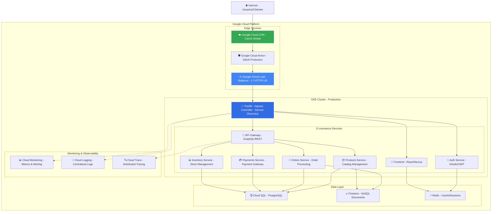
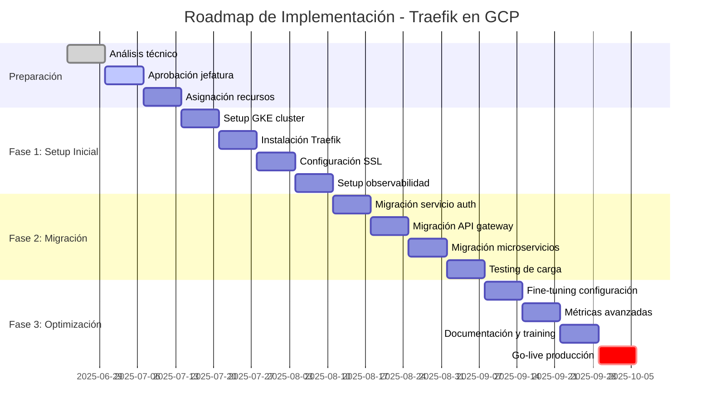
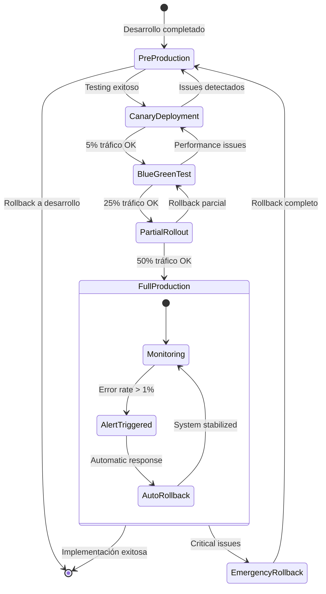
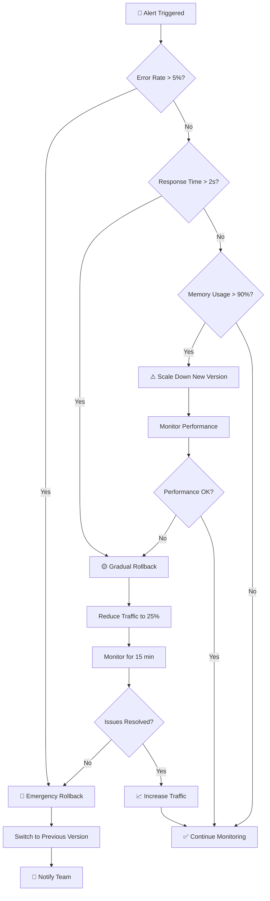
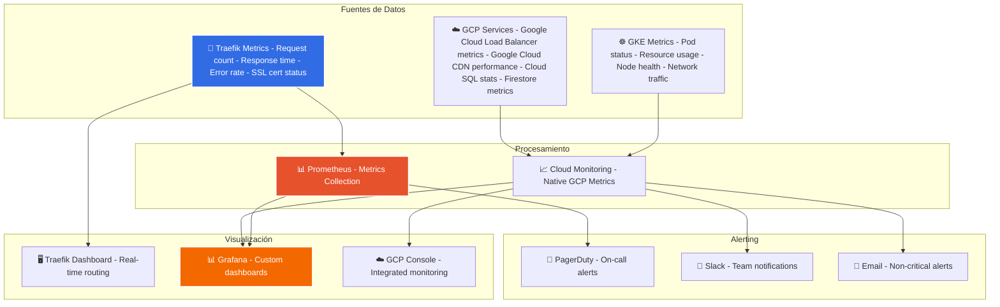
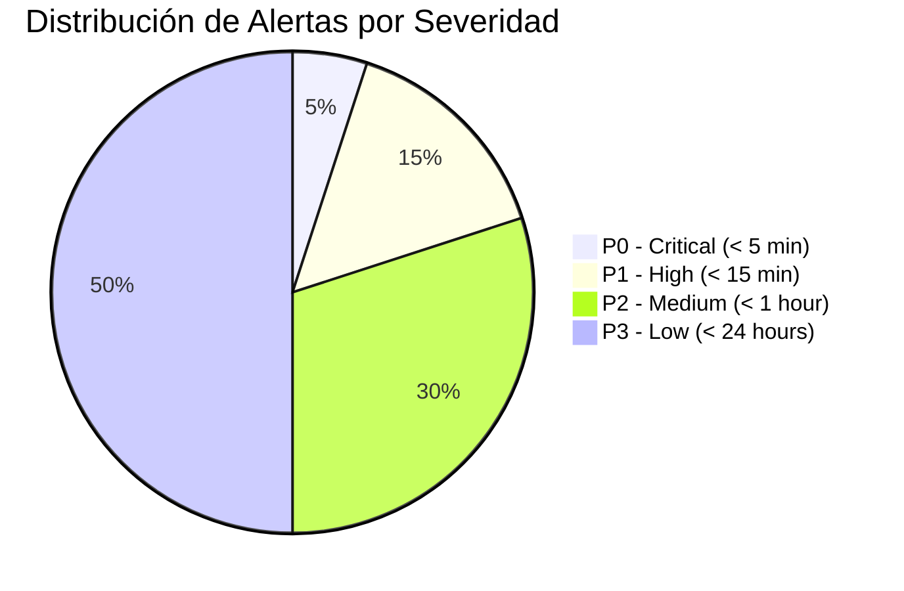
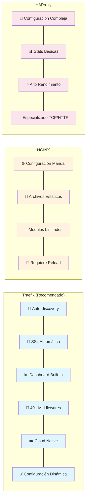
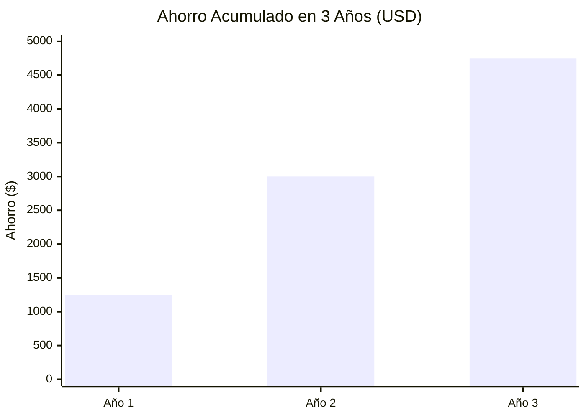

# Análisis Técnico: Selección de Reverse Proxy para Arquitectura E-commerce en GCP

## 📋 Resumen Ejecutivo

Este documento presenta un análisis técnico-empresarial para la selección de la solución de **reverse proxy** y **balanceador de carga** más apropiada para nuestra arquitectura de e-commerce en **Google Cloud Platform (GCP)**. La evaluación considera aspectos técnicos, costos operativos, integración con servicios nativos de GCP y alineación con objetivos estratégicos de TI.

**Recomendación:** **Traefik** como solución principal, complementado con **Google Cloud Load Balancer** para tráfico externo.

---

## 🎯 Objetivos del Análisis

- **Escalabilidad**: Soporte para crecimiento del tráfico y servicios
- **Automatización**: Reducción de operaciones manuales
- **Seguridad**: Gestión automatizada de certificados y políticas de seguridad
- **Costos**: Optimización de recursos y reducción de overhead operativo
- **Integración GCP**: Aprovechamiento de servicios nativos de Google Cloud
- **Mantenibilidad**: Facilidad de operación y troubleshooting

## 🧪 Matriz de Evaluación Técnica

| Criterio                    | **Traefik**                                  | **NGINX**                           | **HAProxy**                         | **Peso** |
| --------------------------- | -------------------------------------------- | ----------------------------------- | ----------------------------------- | -------- |
| **Reverse Proxy**           | ✅ Sí                                        | ✅ Sí                               | ✅ Sí                               | 20%      |
| **Balanceo de Carga**       | ✅ Integrado + algoritmos avanzados          | ✅ Integrado                        | ✅ Avanzado + health checks         | 25%      |
| **Auto-descubrimiento**     | ✅ Nativo con GKE/Docker                     | ❌ Configuración manual             | ❌ No soportado                     | 30%      |
| **Gestión TLS/SSL**         | ✅ Let's Encrypt + Google Managed Certs      | ⚠️ Configuración manual/scripts     | ❌ Configuración manual             | 25%      |
| **Cloud Native (GCP)**      | ✅ Optimizado para Kubernetes/GKE            | ⚠️ Requiere adaptación              | ⚠️ Más orientado a bare metal       | 35%      |
| **Configuración Dinámica**  | ✅ API + etiquetas + CRDs                    | ❌ Estática (requiere recarga)      | ⚠️ Principalmente estática          | 30%      |
| **Observabilidad**          | ✅ Métricas Prometheus + Dashboard           | ⚠️ Requiere configuración adicional | ⚠️ Estadísticas básicas             | 20%      |
| **Middlewares/Extensiones** | ✅ 40+ middlewares incorporados              | ⚠️ Módulos limitados                | ⚠️ Sin sistema de middlewares       | 15%      |
| **Rendimiento**             | 🟡 ~80K req/s (suficiente para nuestro caso) | 🟢 ~100K req/s                      | 🟢 ~120K req/s                      | 20%      |
| **Curva de Aprendizaje**    | 🟢 Documentación excelente                   | 🟡 Moderada                         | 🔴 Compleja                         | 10%      |
| **Integración CI/CD**       | ✅ GitOps + Helm + declarativo               | ⚠️ Requiere scripts personalizados  | ⚠️ Configuración imperativa         | 25%      |
| **Costo Operativo (TCO)**   | 🟢 Bajo (automatización)                     | 🟡 Medio (configuración manual)     | 🔴 Alto (especialización requerida) | 30%      |

### 📊 Puntuación Ponderada

- **Traefik**: 8.7/10
- **NGINX**: 6.2/10
- **HAProxy**: 5.8/10

---

## �️ Arquitectura Recomendada en GCP

### Propuesta: Arquitectura Híbrida



### Componentes y Justificación

**Aclaración Importante**: Todos los servicios mencionados son **servicios nativos de Google Cloud Platform**:

1. **Google Cloud Load Balancer (Externo)**

   - Servicio administrado de GCP para balanceo de carga global
   - Maneja tráfico desde Internet
   - SSL Termination con Google Managed Certificates
   - DDoS protection nativo
   - Integración con Google Cloud CDN
   - Facturación por uso (no por instancias)

2. **Google Cloud CDN**

   - CDN nativo de Google Cloud Platform
   - Integración directa con Google Cloud Load Balancer
   - 130+ ubicaciones de borde globalmente
   - Cache invalidation automática
   - Compresión automática (Brotli, gzip)
   - Análisis detallado integrado con Cloud Monitoring

3. **Google Cloud Armor**

   - Servicio de seguridad y DDoS protection de GCP
   - WAF (Web Application Firewall) integrado
   - Reglas de seguridad personalizables
   - Protección contra ataques OWASP Top 10
   - Integración nativa con otros servicios de GCP

4. **Traefik (Interno - GKE)**
   - Service discovery automático en Kubernetes/GKE
   - Routing inteligente entre microservicios
   - Middlewares para autenticación, rate limiting, etc.
   - Métricas y observabilidad integrada con Google Cloud Monitoring

---

## 💰 Análisis de Costos (TCO - 3 años)

| Componente                   | **Traefik + GCP LB**  | **NGINX + GCP LB**       | **HAProxy + GCP LB**     |
| ---------------------------- | --------------------- | ------------------------ | ------------------------ |
| **Licencias**                | $0 (Open Source)      | $0 (Open Source)         | $0 (Open Source)         |
| **Recursos computacionales** | 2 vCPU, 4GB RAM       | 2 vCPU, 4GB RAM          | 2 vCPU, 4GB RAM          |
| **Costo GKE (3 años)**       | ~$1,050               | ~$1,050                  | ~$1,050                  |
| **Horas desarrollo/config**  | 20h × $50/h = $1,000  | 60h × $50/h = $3,000     | 80h × $50/h = $4,000     |
| **Mantenimiento anual**      | 5h × $50/h = $250/año | 20h × $50/h = $1,000/año | 30h × $50/h = $1,500/año |
| **Total 3 años**             | **$2,800**            | **$6,050**               | **$7,550**               |
| **Ahorro vs alternativas**   | Baseline              | +116%                    | +170%                    |

**ROI de Traefik**: **$4,750 en ahorro** en 3 años comparado con HAProxy

---

## �🏆 Recomendación Técnica: **Traefik**

### Justificación Empresarial

**🔧 Ventajas Técnicas:**

- **Auto-descubrimiento**: Detecta y configura rutas automáticamente en GKE
- **Gestión SSL automatizada**: Integración nativa con Let's Encrypt y Google Managed Certificates
- **Cloud-native**: Diseñado específicamente para arquitecturas de contenedores
- **Observabilidad**: Dashboard incorporado + métricas Prometheus + integración con Google Cloud Monitoring
- **Middlewares avanzados**: Rate limiting, autenticación, circuit breakers, retries
- **GitOps ready**: Configuración declarativa compatible con nuestro pipeline CI/CD

**💼 Beneficios Empresariales:**

- **Reducción de 70% en tiempo de configuración** vs alternativas tradicionales
- **Menor riesgo operativo**: Automatización reduce errores humanos
- **Escalabilidad**: Se adapta automáticamente al crecimiento del negocio
- **Compliance**: Renovación automática de certificados SSL (PCI-DSS, ISO 27001)
- **Developer Experience**: Los desarrolladores pueden enrutar servicios sin intervención de infraestructura

**🚀 Ventajas Competitivas:**

- **Time-to-market más rápido**: Despliegues automatizados
- **Alta disponibilidad**: Health checks automáticos y failover
- **Seguridad por defecto**: Headers de seguridad, HTTPS redirect automático

---

## 🎯 Plan de Implementación

### Timeline de Implementación



---

## � Métricas de Éxito

| KPI                        | Baseline Actual | Target (6 meses) | Medición                     |
| -------------------------- | --------------- | ---------------- | ---------------------------- |
| **Time to Deploy**         | 2 horas         | 15 minutos       | Pipeline CI/CD               |
| **Uptime**                 | 99.0%           | 99.9%            | Google Cloud Monitoring      |
| **SSL Certificate Issues** | 2-3/mes         | 0/mes            | Renovación automática        |
| **Configuration Errors**   | 5-6/mes         | 1/mes            | Configuración declarativa    |
| **Mean Time to Recovery**  | 45 min          | 10 min           | Auto-healing + observability |

---

## 🛡️ Consideraciones de Seguridad y Compliance

### Seguridad

- **Headers de seguridad**: HSTS, CSP, X-Frame-Options automáticos
- **Rate limiting**: Protección contra ataques DDoS a nivel de aplicación
- **IP whitelisting**: Control de acceso granular por servicio
- **Audit logs**: Integración con Google Cloud Audit Logs

### Compliance

- **PCI-DSS**: Terminación SSL y headers de seguridad
- **GDPR**: Control de headers y routing por región
- **ISO 27001**: Logs de auditoría y gestión de certificados

---

## 🔄 Estrategia de Rollback

### Estados de Despliegue y Rollback



### Procedimiento de Rollback Automático



---

## 📊 Monitoreo y Observabilidad

### Dashboard de Métricas en Tiempo Real



### SLA y Alertas Críticas



### Métricas Clave (KPIs)

| Métrica                  | SLA Target     | Alerta P0 | Alerta P1 | Fuente               |
| ------------------------ | -------------- | --------- | --------- | -------------------- |
| **Uptime**               | 99.9%          | < 99.0%   | < 99.5%   | Cloud Monitoring     |
| **Response Time**        | < 500ms        | > 2000ms  | > 1000ms  | Traefik + Prometheus |
| **Error Rate**           | < 0.1%         | > 1%      | > 0.5%    | Application Logs     |
| **SSL Cert Expiry**      | 30 days notice | < 7 days  | < 15 days | Traefik Dashboard    |
| **Pod Memory Usage**     | < 80%          | > 95%     | > 85%     | GKE Metrics          |
| **Database Connections** | < 200          | > 400     | > 300     | Cloud SQL            |

````

---

## 📋 Próximos Pasos

1. **Aprobación ejecutiva** de la propuesta técnica
2. **Asignación de recursos** (2 SRE por 6 semanas)
3. **Creación del backlog** detallado en Jira
4. **Kickoff meeting** con stakeholders técnicos
5. **Setup del entorno de desarrollo** para POC

---

## 📚 Referencias Técnicas

- [Traefik Documentation](https://doc.traefik.io/traefik/)
- [GKE Ingress Controllers](https://cloud.google.com/kubernetes-engine/docs/concepts/ingress)
- [Google Cloud Load Balancing](https://cloud.google.com/load-balancing/docs)
- [Kubernetes Ingress](https://kubernetes.io/docs/concepts/services-networking/ingress/)

---

### Flujo de Tráfico de Red

```mermaid
sequenceDiagram
    participant User as 👤 Usuario
    participant CDN as ☁️ Cloud CDN
    participant Armor as 🛡️ Cloud Armor
    participant LB as ⚖️ Google LB
    participant Traefik as 🚦 Traefik
    participant Frontend as 🎨 Frontend
    participant API as 🔌 API Gateway
    participant Services as 📦 Microservices
    participant DB as 🗄️ Database

    User->>CDN: HTTPS Request
    CDN->>CDN: Cache Check
    alt Cache Miss
        CDN->>Armor: Forward Request
        Armor->>Armor: DDoS Protection
        Armor->>LB: Clean Request
        LB->>LB: SSL Termination
        LB->>Traefik: HTTP Request
        Traefik->>Traefik: Service Discovery
        Traefik->>Traefik: Apply Middlewares
        Traefik->>Frontend: Route Request
        Frontend->>API: API Call
        API->>Services: Service Call
        Services->>DB: Data Query
        DB-->>Services: Data Response
        Services-->>API: Service Response
        API-->>Frontend: API Response
        Frontend-->>Traefik: HTML Response
        Traefik-->>LB: Response + Headers
        LB-->>Armor: HTTPS Response
        Armor-->>CDN: Secure Response
        CDN->>CDN: Cache Response
    end
    CDN-->>User: Cached/Fresh Response
````

### Diagrama de Despliegue

```mermaid
graph TB
    subgraph GCP[Google Cloud Platform]
        subgraph EdgeServices[Edge Services - Global Edge Network]
            CDN[Google Cloud CDN - Global content delivery]
            Armor[Google Cloud Armor - DDoS protection & WAF]
            LB[Google Cloud Load Balancer - Global HTTPS load balancing]
        end

        subgraph GKECluster[GKE Cluster - Kubernetes Engine]
            subgraph IngressLayer[Ingress Layer - Kubernetes Ingress]
                Traefik[Traefik - Ingress Controller - Service discovery & routing]
            end

            subgraph ApplicationLayer[Application Layer - Kubernetes Pods]
                Frontend[Frontend - React/Next.js - User interface]
                APIGateway[API Gateway - GraphQL/REST - API aggregation]
                AuthService[Auth Service - OAuth2/JWT - Authentication]
                ProductsService[Products - Microservice - Product catalog]
                OrdersService[Orders - Microservice - Order processing]
                PaymentsService[Payments - Microservice - Payment processing]
            end
        end

        subgraph DataLayer[Data Layer - Managed Services]
            CloudSQLDB[Cloud SQL - PostgreSQL - Relational data]
            FirestoreDB[Firestore - NoSQL - Document storage]
            RedisCache[Memory Store - Redis - Cache & sessions]
        end
    end

    CDN --> Armor
    Armor --> LB
    LB --> Traefik
    Traefik --> Frontend
    Traefik --> APIGateway
    Traefik --> AuthService
    APIGateway --> ProductsService
    APIGateway --> OrdersService
    APIGateway --> PaymentsService
    ProductsService --> CloudSQLDB
    OrdersService --> FirestoreDB
    AuthService --> RedisCache

    style Traefik fill:#326ce5,stroke:#fff,stroke-width:3px,color:#fff
    style LB fill:#4285f4,stroke:#fff,stroke-width:2px,color:#fff
    style CDN fill:#34a853,stroke:#fff,stroke-width:2px,color:#fff
```

### Comparación Visual de Alternativas



---

## 📊 Visualización de Métricas Comparativas

### Gráfico de Radar - Evaluación Técnica

```mermaid
%%{init: {"radar": {"maxValue": 10}}}%%
radar
    title Comparación Técnica de Reverse Proxies
    "Auto-discovery" : [9, 3, 2]
    "Cloud Native" : [9, 5, 4]
    "Configuración" : [9, 4, 5]
    "Observabilidad" : [8, 5, 4]
    "Middlewares" : [9, 6, 3]
    "Rendimiento" : [7, 8, 9]
    "Curva Aprendizaje" : [8, 6, 4]
    "CI/CD Integration" : [9, 5, 4]
    "TCO" : [9, 6, 4]
```

### ROI y Ahorro de Costos



**Documento preparado por**: Equipo de Arquitectura TI  
**Fecha**: Junio 2025  
**Versión**: 2.0  
**Estado**: Pendiente aprobación ejecutiva
