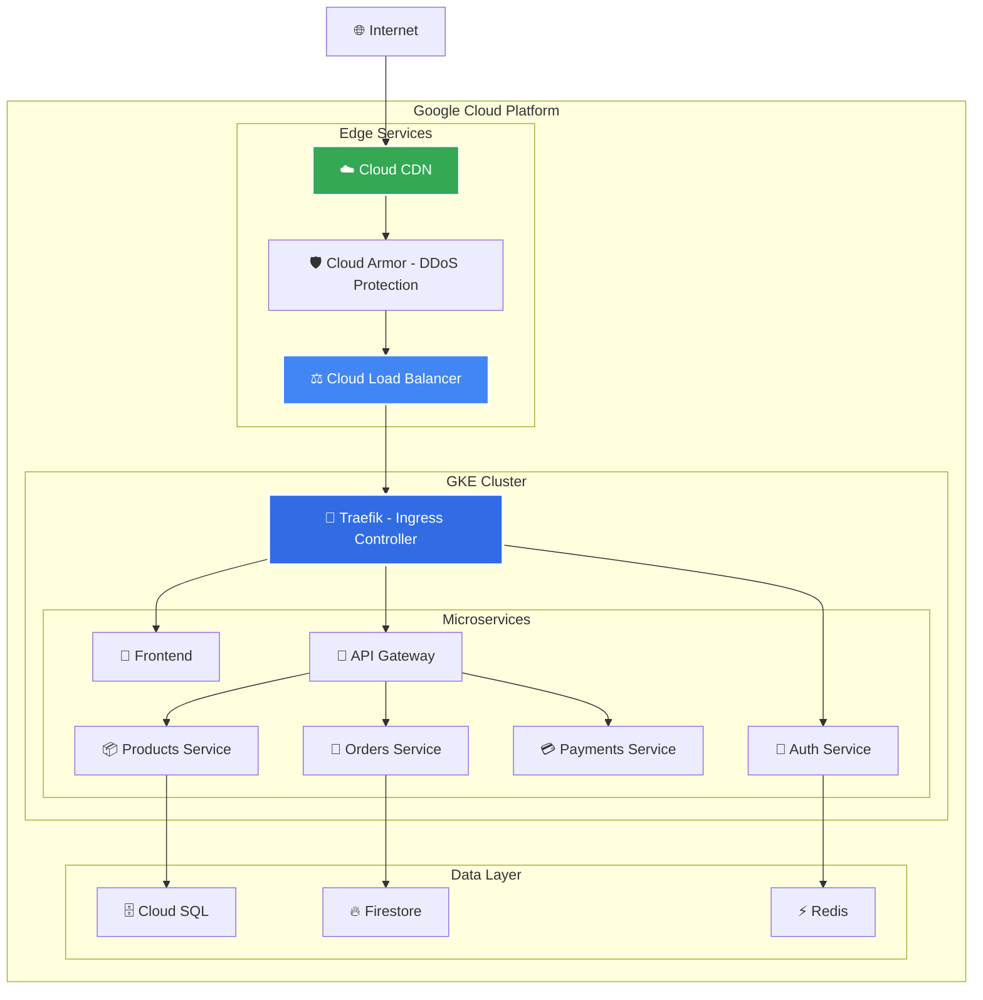
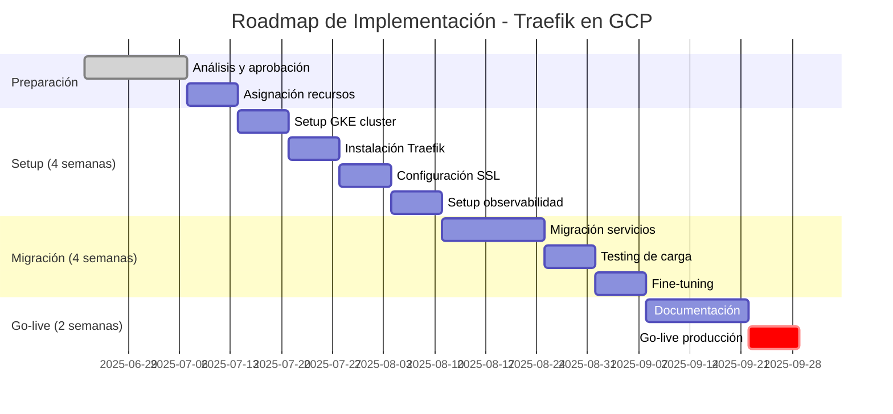

# Análisis Técnico: Selección de Reverse Proxy para Arquitectura E-commerce en GCP

## 📋 Resumen Ejecutivo

Este documento presenta un análisis técnico-empresarial para la selección de la solución de **reverse proxy** y **balanceador de carga** más apropiada para nuestra arquitectura de e-commerce en **Google Cloud Platform (GCP)**.

**Recomendación:** **Traefik** como solución principal, complementado con **Google Cloud Load Balancer** para tráfico externo.

### 🎯 Objetivos Clave

- **Escalabilidad**: Soporte para crecimiento del tráfico y servicios
- **Automatización**: Reducción de operaciones manuales
- **Seguridad**: Gestión automatizada de certificados y políticas
- **Costos**: Optimización de recursos y reducción de overhead operativo
- **Integración GCP**: Aprovechamiento de servicios nativos
- **Mantenibilidad**: Facilidad de operación y troubleshooting

## 📊 Evaluación Técnica Comparativa

### Matriz de Evaluación

| Criterio                   | **Traefik**                         | **NGINX**                      | **HAProxy**                 | **Peso** |
| -------------------------- | ----------------------------------- | ------------------------------ | --------------------------- | -------- |
| **Auto-descubrimiento**    | ✅ Nativo con GKE/Docker            | ❌ Manual                      | ❌ No soportado             | 30%      |
| **Cloud Native (GCP)**     | ✅ Optimizado para Kubernetes       | ⚠️ Requiere adaptación         | ⚠️ Orientado a bare metal   | 35%      |
| **Configuración Dinámica** | ✅ API + etiquetas + CRDs           | ❌ Estática (requiere recarga) | ⚠️ Principalmente estática  | 30%      |
| **Gestión TLS/SSL**        | ✅ Let's Encrypt + Google Managed   | ⚠️ Manual/scripts              | ❌ Manual                   | 25%      |
| **Balanceo de Carga**      | ✅ Integrado + algoritmos avanzados | ✅ Integrado                   | ✅ Avanzado + health checks | 25%      |
| **Observabilidad**         | ✅ Métricas Prometheus + Dashboard  | ⚠️ Configuración adicional     | ⚠️ Básicas                  | 20%      |
| **Rendimiento**            | 🟡 ~80K req/s                       | 🟢 ~100K req/s                 | 🟢 ~120K req/s              | 20%      |
| **Middlewares**            | ✅ 40+ incorporados                 | ⚠️ Limitados                   | ⚠️ Sin sistema              | 15%      |
| **Integración CI/CD**      | ✅ GitOps + Helm + declarativo      | ⚠️ Scripts personalizados      | ⚠️ Imperativa               | 25%      |
| **Curva de Aprendizaje**   | 🟢 Excelente documentación          | 🟡 Moderada                    | 🔴 Compleja                 | 10%      |

### 📊 Puntuación Final

- **Traefik**: 8.7/10
- **NGINX**: 6.2/10
- **HAProxy**: 5.8/10

## 🏗️ Arquitectura Recomendada: Arquitectura Híbrida en GCP

### Componentes de la Solución

### Justificación de Componentes

1. **Google Cloud Load Balancer**: Servicio administrado para balanceo global, SSL termination y DDoS protection nativo
2. **Google Cloud CDN**: CDN nativo con 130+ ubicaciones de borde e integración directa con Load Balancer
3. **Google Cloud Armor**: WAF integrado con protección OWASP Top 10 y reglas personalizables
4. **Traefik**: Service discovery automático, routing inteligente entre microservicios y observabilidad integrada

## 💰 Análisis de Costos y ROI (3 años)

| Componente                 | **Traefik + GCP LB**  | **NGINX + GCP LB**       | **HAProxy + GCP LB**     |
| -------------------------- | --------------------- | ------------------------ | ------------------------ |
| **Licencias**              | $0 (Open Source)      | $0 (Open Source)         | $0 (Open Source)         |
| **Recursos GKE**           | 2 vCPU, 4GB RAM       | 2 vCPU, 4GB RAM          | 2 vCPU, 4GB RAM          |
| **Costo GKE (3 años)**     | ~$1,050               | ~$1,050                  | ~$1,050                  |
| **Desarrollo/config**      | 20h × $50/h = $1,000  | 60h × $50/h = $3,000     | 80h × $50/h = $4,000     |
| **Mantenimiento anual**    | 5h × $50/h = $250/año | 20h × $50/h = $1,000/año | 30h × $50/h = $1,500/año |
| **Total 3 años**           | **$2,800**            | **$6,050**               | **$7,550**               |
| **Ahorro vs alternativas** | Baseline              | +116%                    | +170%                    |

**ROI**: **$4,750 en ahorro** en 3 años comparado con HAProxy

## 🏆 Recomendación Final: Traefik

### Ventajas Clave

- **70% reducción en tiempo de configuración** vs alternativas tradicionales
- **Auto-descubrimiento**: Configuración automática de rutas en GKE
- **SSL automatizado**: Let's Encrypt + Google Managed Certificates
- **Observabilidad nativa**: Dashboard + métricas Prometheus + Cloud Monitoring
- **GitOps ready**: Configuración declarativa compatible con CI/CD
- **40+ middlewares**: Rate limiting, autenticación, circuit breakers

### Beneficios Empresariales

- **Time-to-market más rápido**: Despliegues automatizados
- **Menor riesgo operativo**: Automatización reduce errores humanos
- **Compliance automático**: Renovación SSL (PCI-DSS, ISO 27001)
- **Developer Experience**: Enrutamiento sin intervención de infraestructura

## 🎯 Plan de Implementación

### Timeline (10 semanas)

### Métricas de Éxito

| KPI                | Baseline | Target (6 meses) |
| ------------------ | -------- | ---------------- |
| **Time to Deploy** | 2 horas  | 15 minutos       |
| **Uptime**         | 99.0%    | 99.9%            |
| **SSL Issues**     | 2-3/mes  | 0/mes            |
| **Config Errors**  | 5-6/mes  | 1/mes            |
| **MTTR**           | 45 min   | 10 min           |

## � Estrategia de Rollback

### Procedimientos Automáticos

- **Error Rate > 5%**: Rollback inmediato automático
- **Response Time > 2s**: Rollback gradual (50% → 25% → 0%)
- **Memory > 90%**: Scale down automático
- **Alertas críticas**: Notificación PagerDuty + rollback manual

### Estados de Despliegue

1. **Canary (5% tráfico)** → Testing inicial
2. **Blue-Green (25%)** → Validación performance
3. **Partial (50%)** → Prueba de carga
4. **Full Production** → Implementación completa

## 📊 Monitoreo y Observabilidad

### Métricas y Alertas

| Métrica              | SLA Target     | Alerta P0 | Alerta P1 | Fuente               |
| -------------------- | -------------- | --------- | --------- | -------------------- |
| **Uptime**           | 99.9%          | < 99.0%   | < 99.5%   | Cloud Monitoring     |
| **Response Time**    | < 500ms        | > 2000ms  | > 1000ms  | Traefik + Prometheus |
| **Error Rate**       | < 0.1%         | > 1%      | > 0.5%    | Application Logs     |
| **SSL Cert Expiry**  | 30 días notice | < 7 días  | < 15 días | Traefik Dashboard    |
| **Pod Memory Usage** | < 80%          | > 95%     | > 85%     | GKE Metrics          |

### Stack de Observabilidad

- **Traefik Dashboard**: Routing en tiempo real
- **Prometheus + Grafana**: Métricas personalizadas
- **Google Cloud Monitoring**: Métricas nativas GCP
- **Alerting**: PagerDuty (crítico), Slack (equipo), Email (no crítico)

## �️ Seguridad y Compliance

### Características de Seguridad

- **Headers automáticos**: HSTS, CSP, X-Frame-Options
- **Rate limiting**: Protección DDoS a nivel aplicación
- **IP whitelisting**: Control de acceso granular
- **Audit logs**: Integración con Google Cloud Audit Logs

### Cumplimiento Normativo

- **PCI-DSS**: Terminación SSL y headers de seguridad
- **GDPR**: Control de headers y routing por región
- **ISO 27001**: Logs de auditoría y gestión de certificados

## 📋 Próximos Pasos

1. **Aprobación ejecutiva** de la propuesta técnica
2. **Asignación de recursos** (2 SRE por 10 semanas)
3. **Creación del backlog** detallado en Jira
4. **Setup del entorno de desarrollo** para POC
5. **Kickoff meeting** con stakeholders técnicos

---

**Documento preparado por**: Equipo de Arquitectura TI  
**Fecha**: Junio 2025  
**Versión**: 2.0  
**Estado**: Pendiente aprobación ejecutiva
