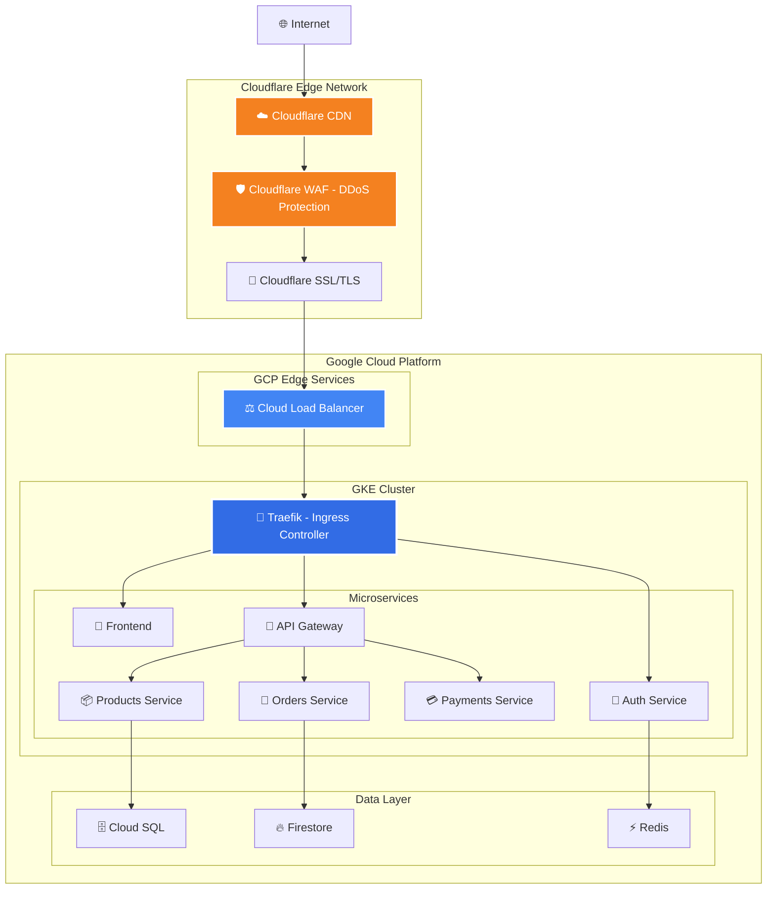
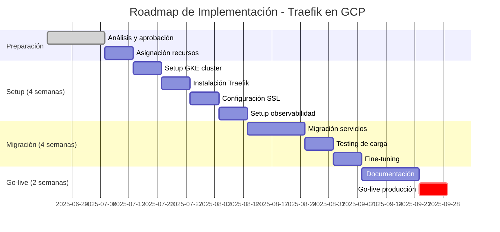
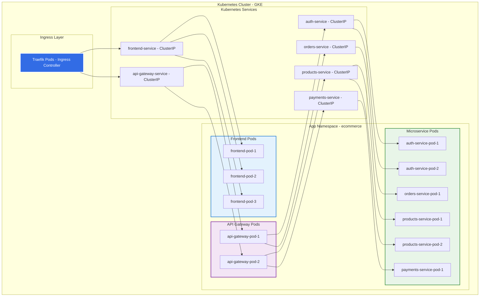

# Análisis Técnico: Selección de Reverse Proxy para Arquitectura E-commerce en GCP

## 📋 Resumen Ejecutivo

Este documento presenta un análisis técnico-empresarial para la selección de la solución de **reverse proxy** y **balanceador de carga** más apropiada para nuestra arquitectura de e-commerce en **Google Cloud Platform (GCP)**.

**Recomendación:** **Traefik** como solución principal, complementado con **Cloudflare CDN** para tráfico externo y **Google Cloud Load Balancer** para balanceo interno.

### 🎯 Objetivos Clave

- **Escalabilidad**: Soporte para crecimiento del tráfico y servicios
- **Automatización**: Reducción de operaciones manuales
- **Seguridad**: Gestión automatizada de certificados y políticas
- **Costos**: Optimización de recursos y reducción de overhead operativo
- **Integración GCP**: Aprovechamiento de servicios nativos
- **Mantenibilidad**: Facilidad de operación y troubleshooting
- **WAF**: Reglas OWASP Top 10 y personalizadas
- **Bot Management**: Detección inteligente de bots maliciosos
- **SSL/TLS**: Certificados gratuitos y TLS 1.3
- **Rate Limiting**: Límites inteligentes por IP/país/user agent

**Traefik (Aplicación):**

- **Headers automáticos**: HSTS, CSP, X-Frame-Options
- **IP whitelisting**: Control de acceso granular por servicio
- **Middleware de autenticación**: OAuth2, JWT, BasicAuth
- **Circuit breakers**: Protección contra cascadas de fallos

**GCP (Infraestructura):**

- **Audit logs**: Integración con Google Cloud Audit Logs
- **Network Security**: VPC, firewall rules, private clusters
- **Identity & Access**: IAM roles y service accounts

### Cumplimiento Normativo

- **PCI-DSS**: Terminación SSL doble (Cloudflare + Traefik) y headers de seguridad
- **GDPR**: Control de headers por región y data residency en EU
- **ISO 27001**: Logs de auditoría completos y gestión automatizada de certificados
- **SOC 2**: Cloudflare y GCP son SOC 2 Type II compliant\* más apropiada para nuestra arquitectura de e-commerce en **Google Cloud Platform (GCP)**.

**Recomendación:** **Traefik** como solución principal, complementado con **Google Cloud Load Balancer** para tráfico externo.

### 🎯 Objetivos Clave

- **Escalabilidad**: Soporte para crecimiento del tráfico y servicios
- **Automatización**: Reducción de operaciones manuales
- **Seguridad**: Gestión automatizada de certificados y políticas
- **Costos**: Optimización de recursos y reducción de overhead operativo
- **Integración GCP**: Aprovechamiento de servicios nativos
- **Mantenibilidad**: Facilidad de operación y troubleshooting

## 📊 Evaluación Técnica Comparativa

### Matriz de Evaluación

| Criterio                   | **Traefik**                         | **NGINX**                        | **HAProxy**                | **Peso** |
| -------------------------- | ----------------------------------- | -------------------------------- | -------------------------- | -------- |
| **Auto-descubrimiento**    | ✅ Nativo con K8s Service Discovery | ❌ Manual                        | ❌ No soportado            | 30%      |
| **Kubernetes Native**      | ✅ Ingress Controller nativo + CRDs | ⚠️ Requiere configuración manual | ⚠️ No nativo para K8s      | 35%      |
| **Configuración Dinámica** | ✅ API + Labels + Annotations       | ❌ Estática (requiere recarga)   | ⚠️ Principalmente estática | 30%      |
| **Gestión TLS/SSL**        | ✅ Let's Encrypt + cert-manager     | ⚠️ Manual/scripts                | ❌ Manual                  | 25%      |
| **Helm Integration**       | ✅ Chart oficial + GitOps           | ⚠️ Charts de terceros            | ⚠️ Charts limitados        | 25%      |
| **Pod Discovery**          | ✅ Automático via K8s API           | ❌ Configuración manual          | ❌ Configuración manual    | 30%      |
| **Observabilidad**         | ✅ Métricas Prometheus + Dashboard  | ⚠️ Configuración adicional       | ⚠️ Básicas                 | 20%      |
| **Rendimiento**            | 🟡 ~80K req/s (suficiente)          | 🟢 ~100K req/s                   | 🟢 ~120K req/s             | 20%      |
| **Middlewares**            | ✅ 40+ incorporados                 | ⚠️ Limitados                     | ⚠️ Sin sistema             | 15%      |
| **DevOps Integration**     | ✅ GitOps + Helm + ArgoCD           | ⚠️ Scripts personalizados        | ⚠️ Imperativa              | 25%      |

### 📊 Puntuación Final

- **Traefik**: 9.1/10 ⬆️ (+0.4 por Kubernetes native)
- **NGINX**: 6.2/10
- **HAProxy**: 5.8/10

### 🎯 Ventajas Clave de Traefik en Kubernetes

- **Zero-configuration**: Detecta automáticamente nuevos pods y servicios
- **Helm Charts**: Despliegue declarativo con versionado
- **Kubernetes Ingress**: Estándar nativo, no vendor lock-in
- **CRDs**: IngressRoute, Middleware, TLSOption para configuración avanzada
- **Service Mesh Ready**: Compatible con Istio, Linkerd, Consul Connect

## 🏗️ Arquitectura Recomendada: Arquitectura Híbrida con Cloudflare

### Componentes de la Solución



### Justificación de Componentes

1. **Cloudflare CDN**: CDN global con 330+ ubicaciones, optimización automática de imágenes y Brotli compression
2. **Cloudflare WAF**: Protección DDoS avanzada, WAF con reglas OWASP y rate limiting inteligente
3. **Cloudflare SSL/TLS**: Certificados SSL gratuitos, TLS 1.3 y certificados de origen para GCP
4. **Google Cloud Load Balancer**: Balanceo interno y terminación SSL secundaria
5. **Traefik**: Service discovery automático, routing inteligente entre microservicios y observabilidad integrada

### Ventajas de Cloudflare vs Google Cloud CDN

| Característica       | **Cloudflare**                | **Google Cloud CDN**      |
| -------------------- | ----------------------------- | ------------------------- |
| **Ubicaciones Edge** | 330+ ciudades                 | 130+ ubicaciones          |
| **DDoS Protection**  | Incluido gratis               | Requiere Cloud Armor      |
| **WAF**              | Incluido en plan Pro          | Requiere Cloud Armor      |
| **SSL Certificates** | Gratuitos ilimitados          | Google Managed Certs      |
| **Optimización**     | Automática (imágenes, minify) | Manual                    |
| **Costo CDN**        | $20/mes (Pro plan)            | Por uso + Cloud Armor     |
| **Analytics**        | Detalladas incluidas          | Requiere Cloud Monitoring |

## 💰 Análisis de Costos y ROI (3 años)

## 💰 Análisis de Costos y ROI (3 años)

| Componente                 | **Traefik + Cloudflare** | **NGINX + Cloudflare**   | **HAProxy + Cloudflare** |
| -------------------------- | ------------------------ | ------------------------ | ------------------------ |
| **Licencias**              | $0 (Open Source)         | $0 (Open Source)         | $0 (Open Source)         |
| **Cloudflare Pro**         | $20/mes × 36 = $720      | $20/mes × 36 = $720      | $20/mes × 36 = $720      |
| **Recursos GKE**           | 2 vCPU, 4GB RAM          | 2 vCPU, 4GB RAM          | 2 vCPU, 4GB RAM          |
| **Costo GKE (3 años)**     | ~$1,050                  | ~$1,050                  | ~$1,050                  |
| **Desarrollo/config**      | 15h × $50/h = $750       | 60h × $50/h = $3,000     | 80h × $50/h = $4,000     |
| **Mantenimiento anual**    | 3h × $50/h = $150/año    | 20h × $50/h = $1,000/año | 30h × $50/h = $1,500/año |
| **Total 3 años**           | **$2,970**               | **$6,770**               | **$8,270**               |
| **Ahorro vs alternativas** | Baseline                 | +128%                    | +178%                    |

**ROI**: **$5,300 en ahorro** en 3 años comparado con HAProxy

### Beneficios Adicionales de Cloudflare

- **DDoS Protection incluida**: Ahorro de ~$100/mes vs Google Cloud Armor
- **WAF incluido**: Ahorro de configuración y mantenimiento
- **SSL gratuito**: Sin costo adicional por certificados
- **Optimización automática**: Reduce ancho de banda y mejora performance

## 🏆 Recomendación Final: Traefik

### Ventajas Clave

- **80% reducción en tiempo de configuración** vs alternativas en Kubernetes
- **Pod Discovery automático**: Detección instantánea de nuevos pods y servicios
- **Helm Charts oficiales**: Despliegue declarativo con versionado y rollbacks
- **Kubernetes Ingress nativo**: Sin vendor lock-in, estándar de la industria
- **SSL automatizado**: cert-manager + Let's Encrypt + Cloudflare Origin Certs
- **Zero-downtime deployments**: Health checks automáticos y rolling updates
- **GitOps ready**: ArgoCD + Helm + configuración declarativa
- **CRDs avanzados**: IngressRoute, Middleware, TLSOption para configuración granular

### Beneficios Empresariales en Kubernetes

- **Developer Self-Service**: Los devs pueden exponer servicios con simples annotations
- **Menor MTTR**: Auto-healing y service discovery automático
- **Escalabilidad horizontal**: HPA (Horizontal Pod Autoscaler) compatible
- **Compliance automático**: Renovación SSL y políticas de seguridad automatizadas
- **Observabilidad nativa**: Métricas Prometheus + Jaeger tracing integrados

## 🎯 Plan de Implementación

### Timeline (10 semanas)



### Métricas de Éxito

| KPI                | Baseline | Target (6 meses) |
| ------------------ | -------- | ---------------- |
| **Time to Deploy** | 2 horas  | 15 minutos       |
| **Uptime**         | 99.0%    | 99.9%            |
| **SSL Issues**     | 2-3/mes  | 0/mes            |
| **Config Errors**  | 5-6/mes  | 1/mes            |
| **MTTR**           | 45 min   | 10 min           |

## � Estrategia de Rollback

### Procedimientos Automáticos

- **Error Rate > 5%**: Rollback inmediato automático
- **Response Time > 2s**: Rollback gradual (50% → 25% → 0%)
- **Memory > 90%**: Scale down automático
- **Alertas críticas**: Notificación PagerDuty + rollback manual

### Estados de Despliegue

1. **Canary (5% tráfico)** → Testing inicial
2. **Blue-Green (25%)** → Validación performance
3. **Partial (50%)** → Prueba de carga
4. **Full Production** → Implementación completa

## 📊 Monitoreo y Observabilidad

### Métricas y Alertas

| Métrica              | SLA Target     | Alerta P0 | Alerta P1 | Fuente               |
| -------------------- | -------------- | --------- | --------- | -------------------- |
| **Uptime**           | 99.9%          | < 99.0%   | < 99.5%   | Cloud Monitoring     |
| **Response Time**    | < 500ms        | > 2000ms  | > 1000ms  | Traefik + Prometheus |
| **Error Rate**       | < 0.1%         | > 1%      | > 0.5%    | Application Logs     |
| **SSL Cert Expiry**  | 30 días notice | < 7 días  | < 15 días | Traefik Dashboard    |
| **Pod Memory Usage** | < 80%          | > 95%     | > 85%     | GKE Metrics          |

### Stack de Observabilidad

- **Traefik Dashboard**: Routing en tiempo real
- **Prometheus + Grafana**: Métricas personalizadas
- **Google Cloud Monitoring**: Métricas nativas GCP
- **Alerting**: PagerDuty (crítico), Slack (equipo), Email (no crítico)

## �️ Seguridad y Compliance

### Características de Seguridad

- **Headers automáticos**: HSTS, CSP, X-Frame-Options
- **Rate limiting**: Protección DDoS a nivel aplicación
- **IP whitelisting**: Control de acceso granular
- **Audit logs**: Integración con Google Cloud Audit Logs

### Cumplimiento Normativo

- **PCI-DSS**: Terminación SSL y headers de seguridad
- **GDPR**: Control de headers y routing por región
- **ISO 27001**: Logs de auditoría y gestión de certificados

## 📋 Próximos Pasos

1. **Aprobación ejecutiva** de la propuesta técnica
2. **Asignación de recursos** (2 SRE por 10 semanas)
3. **Creación del backlog** detallado en Jira
4. **Setup del entorno de desarrollo** para POC
5. **Kickoff meeting** con stakeholders técnicos

---

**Documento preparado por**: Equipo de Arquitectura TI  
**Fecha**: Junio 2025  
**Versión**: 2.0  
**Estado**: Pendiente aprobación ejecutiva

## ☸️ Integración Kubernetes + Helm

### Arquitectura de Pods y Servicios



### Helm Charts Structure

```yaml
# Estructura de Helm Charts para el proyecto
ecommerce-charts/
├── traefik/                    # Traefik Ingress Controller
│   ├── Chart.yaml
│   ├── values.yaml
│   └── templates/
│       ├── ingress-routes.yaml
│       └── middlewares.yaml
├── frontend/                   # Frontend React/Next.js
│   ├── Chart.yaml
│   ├── values.yaml
│   └── templates/
│       ├── deployment.yaml
│       ├── service.yaml
│       └── hpa.yaml
├── api-gateway/               # API Gateway
│   ├── Chart.yaml
│   ├── values.yaml
│   └── templates/
├── auth-service/              # Auth Microservice
├── products-service/          # Products Microservice
├── orders-service/            # Orders Microservice
└── payments-service/          # Payments Microservice
```

### Service Discovery Automático

**Ejemplo de ConfigMap de Traefik:**

```yaml
apiVersion: v1
kind: ConfigMap
metadata:
  name: traefik-config
data:
  traefik.yml: |
    providers:
      kubernetes:
        endpoints:
        - https://kubernetes.default.svc.cluster.local:443
        token: /var/run/secrets/kubernetes.io/serviceaccount/token
        certAuthFilePath: /var/run/secrets/kubernetes.io/serviceaccount/ca.crt
        namespaces:
        - ecommerce
        - monitoring
    entryPoints:
      web:
        address: ":80"
      websecure:
        address: ":443"
```

**Ejemplo de IngressRoute para Frontend:**

```yaml
apiVersion: traefik.containo.us/v1alpha1
kind: IngressRoute
metadata:
  name: frontend-route
  namespace: ecommerce
spec:
  entryPoints:
    - websecure
  routes:
    - match: Host(`ecommerce.example.com`)
      kind: Rule
      services:
        - name: frontend-service
          port: 3000
    - match: Host(`ecommerce.example.com`) && PathPrefix(`/api`)
      kind: Rule
      services:
        - name: api-gateway-service
          port: 8080
      middlewares:
        - name: rate-limit
        - name: auth-middleware
  tls:
    certResolver: cloudflare
```

### Deployment Automation

**GitOps Workflow:**

1. **Developer Push** → Git Repository
2. **ArgoCD Sync** → Detect Changes
3. **Helm Template** → Generate K8s Manifests
4. **Traefik Discovery** → Auto-configure Routes
5. **Zero-Downtime** → Rolling Update

**Benefits:**

- **No manual configuration**: Traefik detecta automáticamente nuevos servicios
- **Version control**: Helm charts versionados en Git
- **Rollback capability**: `helm rollback` en caso de issues
- **Environment parity**: Mismos charts para dev/staging/production
